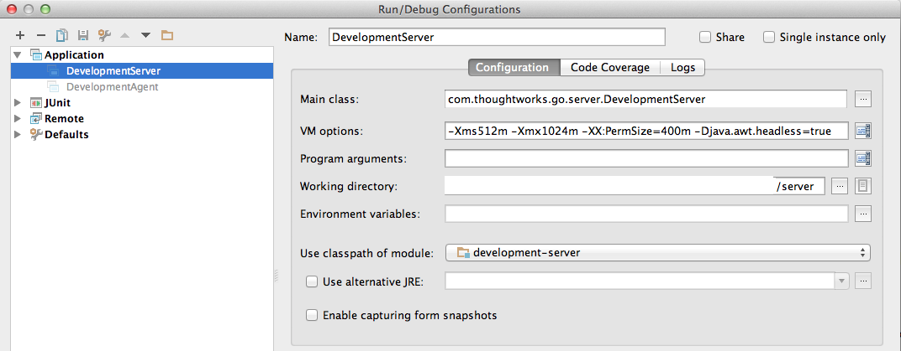

# 3.1 Setting up your development environment

## 3.1.1 Using vagrant to bring up the Go Development environment

> Supported versions: Vagrant **1.4.3+**, VirtualBox **4.3.6+**

The vagrant environment gives you a VM that has everything configured for Go to build and run. For convenience we have written two versions:

- Minimal Go Development Environment: Terminal view
- Gnome based Go Development Environment


You can use the environment in any one of the following two ways:

### You can download the image from

This gives you a Ubuntu Box with Gnome installed.

http://download01.thoughtworks.com/go/vagrant/go.v1.box

http://download01.thoughtworks.com/go/vagrant/Vagrantfile

Download and copy these two files into a directory. Running it is as simple as running the following in that directory:

```
vagrant up
```

### Alternatively, clone the repository containing the vagrant scripts by

```
~/projects$ git clone https://github.com/GoCD/go-development-environment-setup.git
~/projects$ cd go-development-environment-setup
```

You can then do either of the following based on the OS your running:

#### Setting up a minimal Go Development Environment (Linux/Mac) -

```
~/projects/go-development-environment-setup$ ./setup.sh
```

#### Setting up a minimal Go Development Environment (Windows) -

```
C:/projects/go-development-environment-setup$ setup.bat
```

#### Setting up a Gnome based Go Development Environment (Linux/Mac) -

```
~/projects/go-development-environment-setup$ ./setup.gui.sh
```

#### Setting up a Gnome based Go Development Environment (Windows) -

```
C:/projects/go-development-environment-setup$ setup.gui.bat
```

> Note: This version comes with the community edition of intelliJ installed, it opens up the Go project for you (if you don't see the DevelopmentServer configuration, restart intelliJ and check again). For additional details refer to section 3.1.3 & 3.1.4 of this document. 

### Subsequent Runs

The above is just a one time setup. Once the VM is provisioned for subsequent runs, you can bring up the box by running

```
~/projects/go-development-environment-setup$ vagrant up
```

> Note: Network IO might be slow when configured to use NAT (default). You could change it to 'Bridged' mode to improve performance. In this mode, it necessitates that a network interface is chosen upon boot. Add the line below in the Vagrantfile to enable 'Bridged' mode:

>
>```
>config.vm.network :public_network
>```

### Building & Running Go on the VM

After the provisioning, you should automatically get logged into the ubuntu virtual machine (using Virtualbox) environment.

In the minimal version, you will be dropped into the shell. In the Gnome version, you need to go to a terminal. Go code is checked out into /home/vagrant/go directory. 

To get Go up and running do the following:

```
cd /home/vagrant/go
```

```
~/projects/go$ ./b clean
~/projects/go$ ./bn cruise:prepare dist
```

Once this is complete, you can verify that the setup happened correctly, by navigating into go/target/go-server-**version**. In case of Go 14.1.0, 

```
cd go/target/go-server-14.1.0
```

Change permissions for server.sh file and run Go server:

```
vagrant@precise64:~/go/target/go-server-14.1.0$ chmod +x server.sh
vagrant@precise64:~/go/target/go-server-14.1.0$ ./server.sh
```

Access Go server from the host machine by accessing the application at **http://localhost:8153** which should bring up the Go dashboard.

> Note: At times due to port collision, the Go server might be forwarded to a different port. You should be able to find information about it in the console itself. 

### Virtual machines credentials
```
Username: vagrant
```

The vagrant user does not have any password. To set the password use `passwd` command.

## 3.1.2 Setting it up manually

Go requires the following software packages to build

-   JDK 6+ (OpenJDK or Oracle)
-   Ruby (1.8+)
-   Ruby sass gem (3.2.5+)
-   Git (1.7+)
-   Maven (3.1.1+)

Assuming the codebase is cloned into **~/projects/go**, you need to execute the
following commands to build Go

```
~/projects/go$ unset GEM_HOME
~/projects/go$ unset GEM_PATH
~/projects/go$ ./tools/jruby/bin/jruby -J-Xmx2048m -S buildr clean cruise:prepare
```

The above set of commands are captured as part of an executable file named
"**bn**" at the root of the project. In order to achieve the output same as the
above set of commands, you could optionally choose to run

```
~/projects/go$ ./bn clean cruise:prepare
```

After a successful build, the build artifacts are generated inside a directory
named "**target**" in the working directory. The output directory contains JARs
along with the packaged ZIP installer for Go Server and Go Agent.

```
~/projects/go$ ls target
agent
agent-bootstrapper
...
go-agent-14.1.0
go-server-14.1.0
...
util
```

## 3.1.3 Building via IntelliJ IDEA

If you have IntelliJ IDEA configured, you could optionally use it to build Go. 

Prior to build via the IDE, we would have to prepare the working directory by copying the database deltas to the configured location. You can achive this by runnning the below command in the working directory.

```
~/projects/go$ ./b clean
~/projects/go$ ./bn cruise:prepare
```

After the preparation phase has succeeded, 

- Open the project in IDEA
- Build -> Rebuild project

## 3.1.4 Running Development Server via IntelliJ IDEA

When developing using IntelliJ IDEA, it is always convenient to run the Go Server in *development mode*. Apart from the convenience, you also get

- Live debugging
- Faster feedback
- Hotswapping changes while the JVM is up

The IDEA **Application** run-configuration can be setup using the values below:

```
Name: Development Server - H2
Main Class: com.thoughtworks.go.server.DevelopmentServer
VM options: -XX:MaxPermSize=128m
Working directory: <project-directory>/server
Use classpath of module: development-server
```

Configuring IntelliJ IDEA *run-configuration*


Running *Development Server* from IntelliJ IDEA

