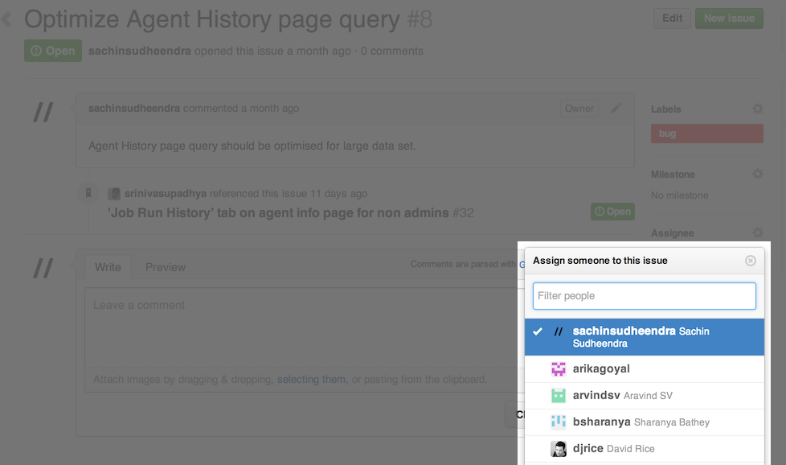

# 3.4 How to go about making changes to the codebase

## 3.4.1 Prerequisites

If your development environment is not set up, please refer to [3.1 Setting up your development environment](3.1.md) for the steps to set up the Go development environment.

## 3.4.2 Assigning an issue

Upon chosing a bug to fix, he/she should assign the bug to his/her name on github.

- Open [github issues](https://github.com/GoCD/GoCD/issues?state=open)
- Assign a bug



- Optionally, start a conversation around the proposed approach (and/or) any questions that you need answers for

## 3.4.3 Fixing the issue

As a demonstration, let us assume a use case of changing the case of one of the header links, namely PIPELINES. The task at hand would be,

> As a user
> I would like to change the case of the header link, i.e., **PIPELINES** to **pipelines**
> So that I can demonstrate how to make changes in Go.

Below are a set of steps that one would follow to achieve this

- Use an IDE to open the codebase. In our case, we shall use IntelliJ IDEA Community

- Locate the rspec file for the intended change. In our case, the header links are present in a file at ```server/webapp/WEB-INF/rails/app/views/shared/_application_nav.html.erb```. By the convention that Go follows, the equivalent rspec for the views are present under ```server/webapp/WEB-INF/rails/spec/views/shared/_application_nav_html_spec.rb```

- Identify the spec which tests this behaviour, or in our case, the view markup.
> We expect every commit to have reasonable tests to indicate the intent. For example, since this happens to be a change on the Rails side, you'd be expected to write/modify an rspec.

```ruby
    describe :header do
        before :each do
          template.stub!(:url_for_path).and_return('url_for_path')
          template.stub!(:url_for).and_return('url_for')
          template.stub!(:can_view_admin_page?).and_return(true)
        end

        it 'should have the header links' do
          render :partial => "shared/application_nav.html.erb"

          assert_header_values = {'recent-activity' => 'PIPELINES', 'environments' => 'ENVIRONMENTS', 'agents' => 'AGENTS', 'admin' => 'ADMIN'}

          response.body.should have_tag("ul.tabs") do
            assert_header_values.each do |key, value|
              with_tag("li#cruise-header-tab-#{key}") do
                with_tag("a", value)
              end
            end
          end
        end
      end
```

- Change rspec to reflect the expected behaviour.

```
    diff --git a/server/webapp/WEB-INF/rails/spec/views/shared/_application_nav_html_spec.rb b/server/webapp/WEB-INF/rails/spec/views/shared/_application_nav_html_spec.rb
    index 8f577f3..c523e89 100644
    --- a/server/webapp/WEB-INF/rails/spec/views/shared/_application_nav_html_spec.rb
    +++ b/server/webapp/WEB-INF/rails/spec/views/shared/_application_nav_html_spec.rb
    @@ -38,7 +38,7 @@ describe "/shared/_application_nav.html.erb" do
           render :partial => "shared/application_nav.html.erb"
    -      assert_header_values = {'recent-activity' => 'PIPELINES', 'environments' => 'ENVIRONMENTS', 'agents' => 'AGENTS', 'admin' => 'ADMIN'}
    +      assert_header_values = {'recent-activity' => 'pipelines', 'environments' => 'ENVIRONMENTS', 'agents' => 'AGENTS', 'admin' => 'ADMIN'}
           response.body.should have_tag("ul.tabs") do
```

- Run spec to assert that it fails.
    1. Start spec server
    ```
    ~/projects/go $ RAILS_ENV=test b cruise:rails:spec_server test=no
    ```
    2. Run spec
    ```
    ~/projects/go $ cd server/webapp/WEB-INF/rails
    ____INF/rails $ ~/projects/go/tools/jruby/bin/jruby script/spec ~/projects/go/server/webapp/WEB-INF/rails/spec/views/shared/_application_nav_html_spec.rb -X
    ```

- Fix the failing spec to match the expectation. In our use case, because localization in Go uses the ```localize.xml``` file to interpolate string values, we will make appropriate changes in that file.

```diff
    diff --git a/server/webapp/localize.xml b/server/webapp/localize.xml
    index 5fc978c..e520f7c 100755
     --- a/server/webapp/localize.xml
     +++ b/server/webapp/localize.xml
     -    <entry key="PIPELINES">PIPELINES</entry>
     +    <entry key="PIPELINES">pipelines</entry>
```

- Run spec to assert that it passes. You can follow the same steps described above to achieve this. (Note: Please restart spec server to load the changed ```localize.xml``` file.)

## 3.4.4 Submitting your fix

Once you are ready with the fix, you can submit your fix to the Go Team by means of [Github pull requests](https://help.github.com/articles/using-pull-requests). Our approval process can be read on our [website](http://go.cd).

## 3.4.5 Updating Github Issues

Your assigned github issue can be updated with the newly submitted pull-request details, along with other content that might help the reviewers understand your implementation better.
