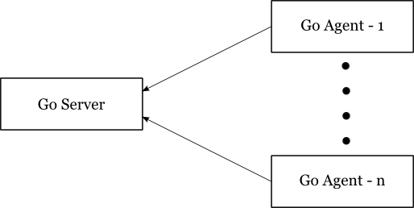

## 5.1 Overview

At the highest level, Go consists of two main components, the Go Server (referred to as "server") and the Go Agent
(referred to as "agent").

As soon as the server comes up, it opens two ports (an SSL port and a non-SSL port). The system works on a pull model in
the sense that the agents periodically poll the server for work, instead of the server pushing work to the agents. This
prevents the agents from having to have listening ports open on their side.

The server coordinates everything, making sure that all the builds that need to run get run and all the agents are
assigned work when possible.

You can read more about the internals of the Go Server [here](5.2.md).

You can also read more about the internals of the Go Agent [here](5.3.md).

Here is a high-level overview of the main flow of Go, where a commit made to a repository is seen by Go and a build is
triggered based on it.

