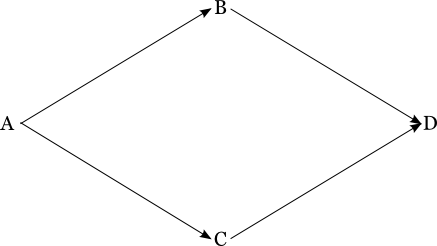

Sample fan-in dependency.

1. If both the pipelines B & C have mutually exclusive blacklist, i.e. say A has 2 folders ’src/’ ’test/’ and B ignores test/ while C ignores src/ AND there are no commits to both folders together then B & C run for different commits only. This leaves D with no compatible runs of B & C that it can trigger off of.
2. If the upstream pipelines B & C are timer triggered / manually triggered they always run off of latest change in A. So if you trigger B & C at different times they may have different revisions of A, causing incompatibility for D.

General reasons for auto-trigger downstream pipelines to not trigger (with errors):

1. If one of the pipelines B or C (say B) is paused/manual and is not running for long, while the other pipeline (C in this case) runs constantly then the resolution of downstream D fails after a few runs of C. This is because Go tries to resolve the upstream pipelines by considering max. upto 100 instances of each upstream pipeline after which it will stop resolution to avoid consuming too much CPU cycles.
2. If an upstream pipeline (say B) is triggered with a older version of A then Go tries to find a version of C which is compatible with that version of A or something older than that. This can fail if you select a version of A that is very old for the same reason as above.
3. If config of an upstream pipeline is changed. say you change A ->X OR add/remove a new material to either of B/C, the resolution of D will fail until there is a green run of all upstream pipelines with the latest material config.
