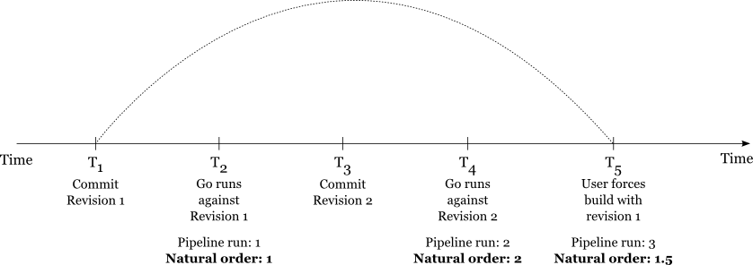

# 6.4 Compare pipeline

### 6.4.1 Overview

Go allows you to compare any two builds of a pipeline and see an aggregation of all the changes that happened between the two instances.

More information about this feature is available [here](http://www.thoughtworks.com/products/docs/go/13.4/help/compare_pipelines.html).

### 6.4.2 Implementation

> Note: This feature uses the concept of **natural ordering**

#### 6.4.2.1 Parameters

**pipelineName** : The name of the pipeline for comparision
**fromCounter** : The pipeline counter (inclusive) to compare from.
**toCounter** : The pipeline counter (inclusive) to compare uptil.

#### 6.4.2.2 Changesets

This feature displays the material changeset that have contributed between the counters under comparison. The changeset is determinded by 

1. loading all the **MaterialRevisions** between the two runs
2. parsing the comment field of each material revision to obtain a list of mingle card numbers that are part of this changeset. The matcher is done as follows:

```java
Pattern pattern = Pattern.compile("#(\\d+)");
...
Matcher matcher = pattern.matcher(comment);
```


#### 6.4.2.3 Mingle Gadget

> This gadget follows the public specification set forth by [Opensocial](http://opensocial.org/)

If Mingle is configured, the mingle card numbers obtained in [Changesets](#6422-changesets) section is used to fetch the mingle gadget. Mingle acts as a gadget provider and serves back the content.

Go ships with a rails plugin named **tw_studios_gadgets** which is placed in ```<rails app>/vendor/plugins/tw_studios_gadgets```. This rails plugin is responsible for requesting Mingle to serve out the gadget.

#### 6.4.2.4 Persistance

The table **oauthclients** holds the OAuth Gadget Provider details.

- CLIENTID - Client ID generated by the gadget provider. In this case, Mingle.
- CLIENTSECRET - Client Secret generated by the gadget provider.
- REDIRECTURI - Redirect URI used for authorization/handshake.


```
                    +-----------------------------+
                    |                             |
                    |        OAUTHCLIENTS         |
                    |                             |
                    +-----------------------------+
                    |      ID (BIGINT)            |
                    |                             |
                    |      NAME (VARCHAR)         |
                    |                             |
                    |      CLIENTID (VARCHAR)     |
                    |                             |
                    |      CLIENTSECRET (VARCHAR) |
                    |                             |
                    |      REDIRECTURI (VARCHAR)  |
                    |                             |
                    +-----------------------------+
```


### 6.4.3 Corner cases

This feature does not work in case of **bisects**. A bisect, in Go, means a split in the sequence of natural ordering. For example, if a user runs the pipeline using an older material revision, i.e., using "Trigger with Option", a bisect occurs in the timeline of the pipeline run with the chosen material revision.

---------------------------------------



---------------------------------------
