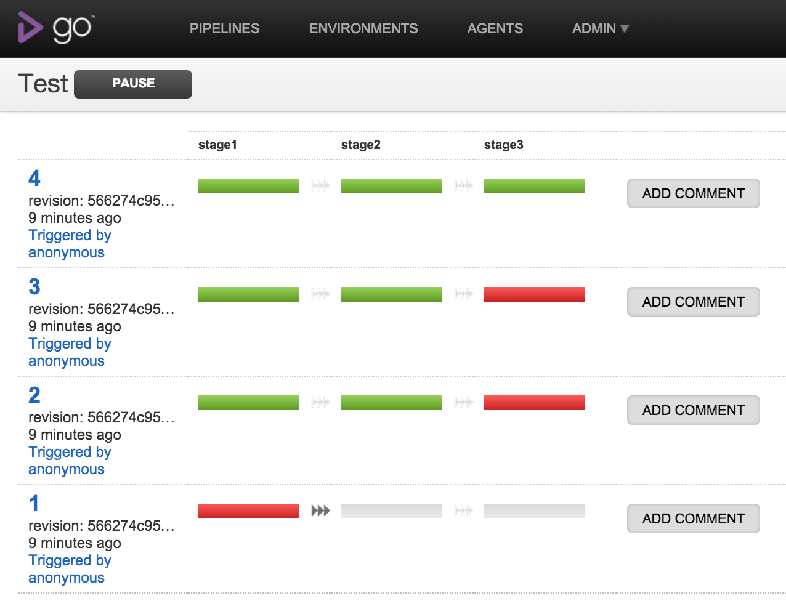
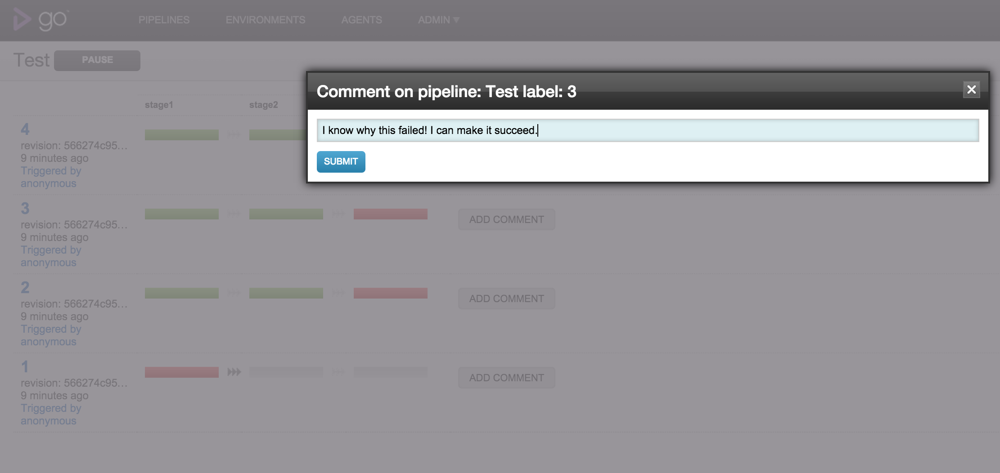
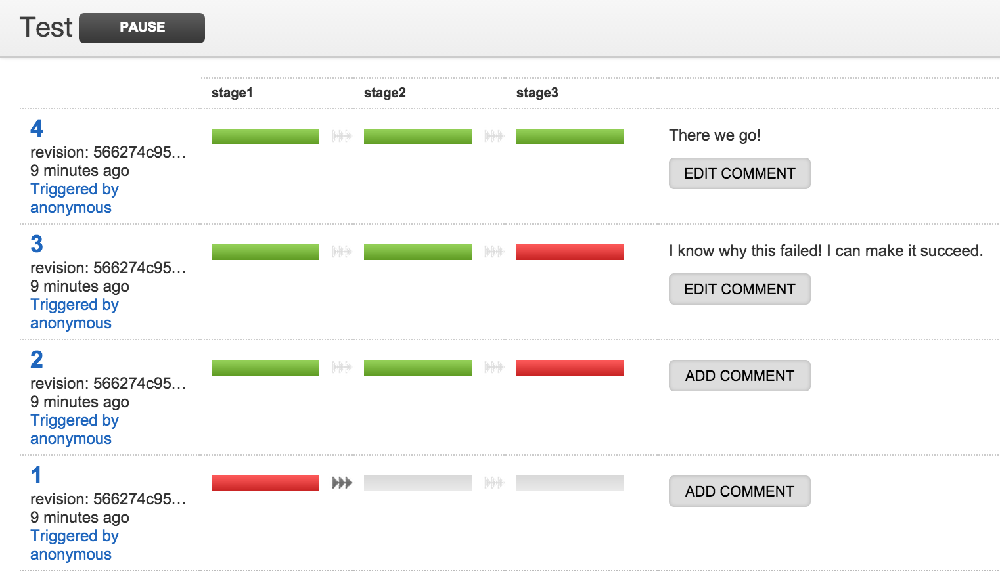

# Beta feature: Comment on a pipeline run

  Note: This is a beta feature, which is turned off by default in GoCD 14.4.0. It can be turned on by using the feature
  toggle API, for this feature. If you are using curl, this is what you will need to do:

  
curl -d toggle_value=on' 'http://go_server/go/api/admin/feature_toggles/pipeline_comment_feature_toggle_key' -H 'Confirm:true'

  When authentication is turned on in your GoCD Server setup, add the --user option to the curl command, like this:

  
curl --user username:password -d 'toggle_value=on' ...

Each pipeline in the [pipeline activity](../navigation/pipeline_activity_page.md) page can now be annotated with a
comment. This text can be seen by all other users who can access this page, for those pipelines.

When this feature is turned on, the pipeline activity page looks like this:

Clicking on the "Add Comment" button for a pipeline run brings up a text box for you to enter some text. It looks
like this:

Once you click "Submit", after entering some text, that text shows up against the pipeline run, like so:

