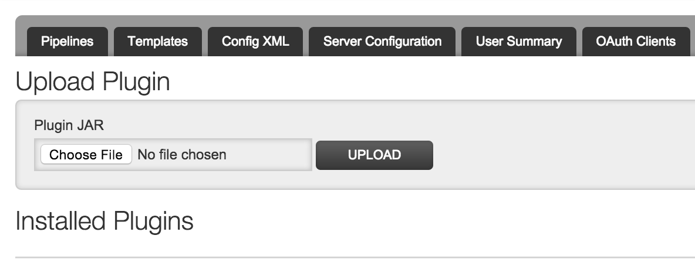

# Beta feature: Upload plugins, from within GoCD, without restarting the server

<div style="background-color: rgba(0, 192, 0, 0.25); padding: 5px; margin-bottom: 1em">
  Note: This is a beta feature, which is turned off by default. It can be turned on using the system environment property <strong>go.plugin.upload.enabled</strong>.
  The property can be updated in the following ways,

  On linux add the following line to /etc/default/go-server
  <div style="font-family: monospace; font-size: 90%; padding-top: 1em; padding-bottom: 1em">export GO_SERVER_SYSTEM_PROPERTIES='-Dgo.plugin.upload.enabled=true'</div>
  On windows, in the config folder of the GoCD server installation, edit/create the wrapper-properties.conf file, and add an additional property with the value '-Dgo.plugin.upload.enabled=true'. For example:
  <div style="font-family: monospace; font-size: 90%; padding-top: 1em; padding-bottom: 1em">wrapper.java.additional.17='-Dgo.plugin.upload.enabled=true'</div>
</div>

Without this feature turned on, the plugins list page looks like this:


When this feature is turned on, the plugins list page will include a form to upload a plugin:



For this upload to work, you need to turn on another flag during startup (sorry, there is a reason for not turning this
on, though). The [system property](../advanced_usage/other_config_options.html#system-properties) you need to set is
```pluginLocationMonitor.sleepTimeInSecs```. You can set that to something like 3 seconds, by [changing](../advanced_usage/other_config_options.html#system-properties)
```GO_SERVER_SYSTEM_PROPERTIES``` to include ```-DpluginLocationMonitor.sleepTimeInSecs=3```, for instance.

Once you have that setup, and add a plugin using the upload form above, you'll see a message about the successful save
of the plugin. Within 3 seconds (property you set earlier), the plugin will be loaded, and you can see it when you
refresh the plugin listing page.
