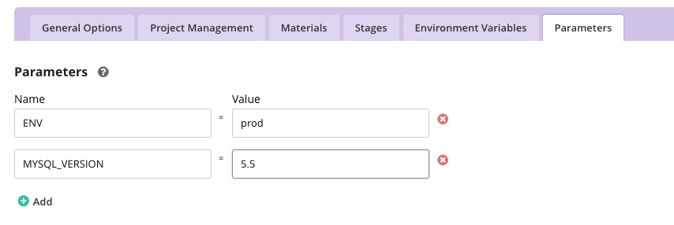

# Parameterize your Configuration

GoCD allows you to parameterize your pipelines and pipeline templates. This powerful feature can help reduce repetition within your configurations and also allows for complex setups using a combination of parameters and pipeline templates.

## Using Web Interface

Edit the **Parameters** tab when defining a **pipeline** .



## Defining and using a parameter

Parameter values are defined in the ```<params>``` tag within a pipeline and can be used anywhere within that pipeline using \#{param\_name}. The following example defines a new parameter called "myParam" and uses it in a job.

```xml
<pipeline name="my_pipeline">
  <params>
    <param name="myParam">hello world</param>
  </params>
  <stage name="my_stage">
    <jobs>
      <job name="my_job">
        <tasks>
          <exec command="echo" args="#{myParam}"/>
        </tasks>
      </job>
    </jobs>
  </stage>
</pipeline>

```

> **NOTE:** If you want to use the **\#** literal, you can escape it using another **\#** literal. For example, if the parameter "foo" has the value "one", then:

| String   | Evaluates to
|:----------|:-------------:
| #{foo} |  one
| ##{foo} |   #{foo}
| ###{foo} |#one

## Using parameters in pipeline templates

Parameter usage within [templates](pipeline_templates.md) is similar to usage within pipelines. The only difference is that you cannot **define** parameters in a template.

```xml
<pipeline name="trunk" template="my_template">
  <params>
    <param name="WORKING_DIR">trunk</param>
  </params>
  ...
</pipeline>

<pipeline name="branch" template="my_template">
  <params>
    <param name="WORKING_DIR">branch</param>
  </params>
  ...
</pipeline>

```

The parameter defined above is used the template below.

```xml
<pipeline name="my_template">
  <stage name="my_stage">
    <jobs>
      <job name="my_job">
        <tasks>
          <exec command="echo" args="Updating code from svn repository svn://codebase/#{WORKING_DIR}"/>
        </tasks>
      </job>
    </jobs>
  </stage>
</pipeline>

```

## Rules around usage of parameters

While parameters are generally very flexible, there are some restrictions.

**You cannot use a parameter to define:**

-   Pipeline name
-   Stage name
-   Job name
-   A Job's property name
-   The ```<runif>``` configuration for a job's task
-   Another parameter (i.e. you cannot define a parameter using another parameter)
-   Pipeline template name
-   Material name
-   Material passwords (however, for Git and Mercurial, passwords are not captured as separate attribute, hence can be parameterized)
-   Trigger-type for Stage

**Other restrictions:**

-   Parameters can currently only be defined within a pipeline.
-   A parameter cannot be composed with another parameter i.e. \#{foo\#{bar}} will not be evaluated recursively.
-   If a parameter is referenced but is not defined, then the configuration is invalid (Go will not let you save an invalid configuration).
