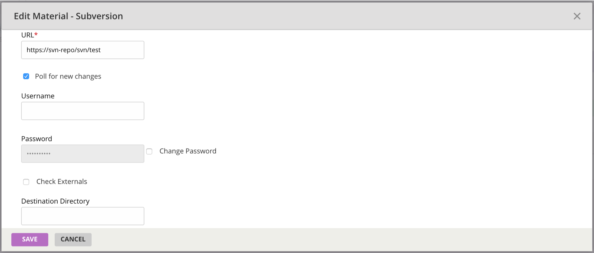
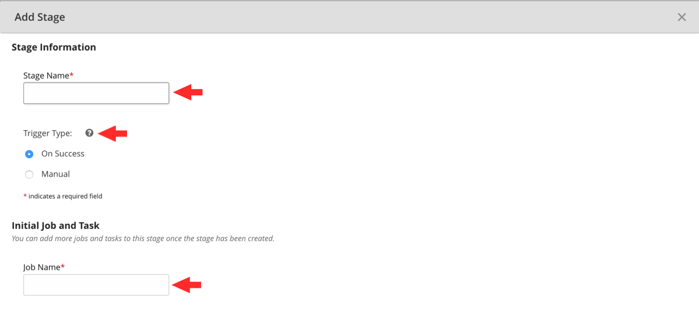
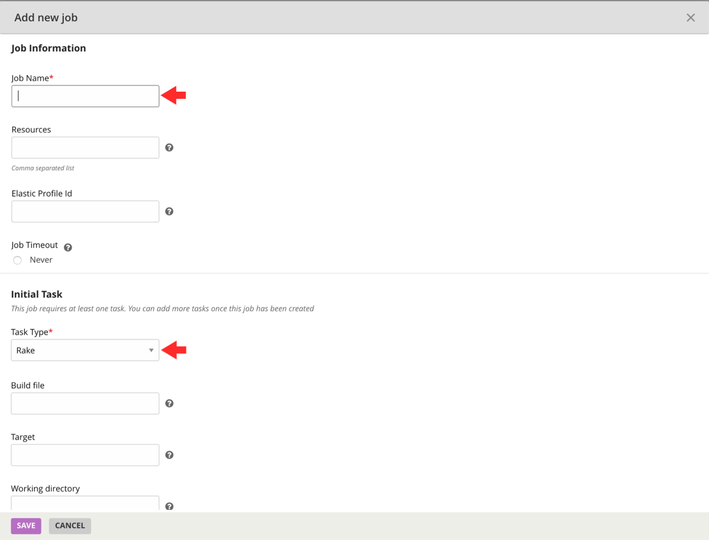
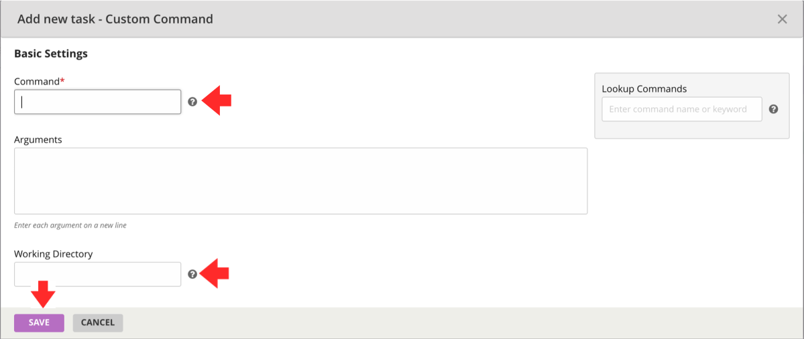
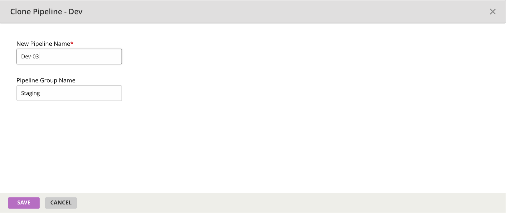
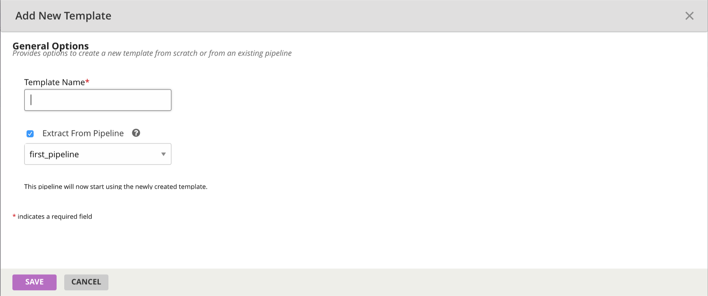
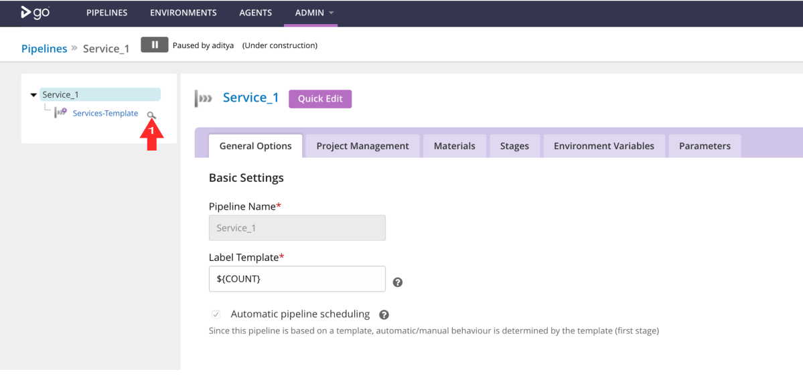
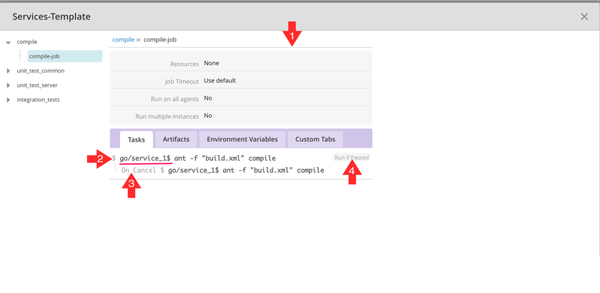

# Managing pipelines

Go can be configured using [Administration](../navigation/administration_page.md) Tab. You can perform operations like add/edit Pipelines, Stages, Jobs, Tasks, Templates and Pipeline group. You can also configure Go by editing the full XML file if you wish, by clicking on the **Config XML** section of the [Administration](../navigation/administration_page.md) tab. Go will check the syntax of the configuration before it saves it again

## Creating a new pipeline

To create a new pipeline, go to the **Pipelines** sub-tab of the [Administration](../navigation/administration_page.md) tab and click on the ["Create a new pipeline within this group"](quick_pipeline_setup.md) link as shown in the screen shot below.


## Add a new material to an existing pipeline

Now that you have a pipeline, lets add another material to it.

-   Navigate to the new pipeline you created by clicking on the **Edit** link under the Actions against it. You can also click on the name of the pipeline.


-   Click on the Materials tab.


-   You will notice an existing material . Click on the "Add new material" link.


-   You will get the following message


-   Edit the existing material and specify the destination directory



-   Click "Save".

## Blacklist

Often you do want to specify a set of files that Go should ignore when it checks for changes. Repository changesets which contain only these files will not automatically trigger a pipeline. These are detailed in the [ignore](configuration_reference.md#ignore) section of the [configuration reference](configuration_reference.md).

-   Enter the items to blacklist using ant-style syntax below


-   Click "Save".

## Add a new stage to an existing pipeline

Now that you have a pipeline with a single stage, lets add more stages to it.

-   Navigate to the new pipeline you created by clicking on the **Edit** link under the Actions against it. You can also click on the name of the pipeline.


-   Click on the Stages tab.


-   You will notice that a defaultStage exists. Click on the "Add new stage" link.


-   Fill stage name and trigger type.

-   Fill in the details for the first job and first task belonging to this job. You can [add more jobs](admin_add_job.md) and [add more tasks](admin_add_task.md) to the jobs.

-   Click on help icon next to the fields to get additional details about the fields you are editing.



-   Click "Save".

## Add a new job to an existing stage

Now that we have a pipeline with stage(s), we can add more jobs to any of the existing stages. You can now use the tree navigation on the left side of the screen to edit a stage or a job under a pipeline.

-   Click on the stage name that you want to edit on the tree as shown below. The "defaultStage" is being edited.


-   Click on the Jobs tab

-   Click on "Add new job"


-   Fill job name and job details



-   Fill in the details for the initial task belonging to this job. You can edit this job later to [add more tasks](admin_add_task.md)

-   You can choose the type of the task as required.

-   For task types Ant, Nant and Rake, the build file and target will default as per the tool used. For example, Ant task, would look for build.xml in the working directory, and use the default task if nothing is mentioned.

-   Click on help icon next to the fields to get additional details about the fields you are editing.

-   Click "Save"

## Add a new task to an existing Job

Now that we have a pipeline with stage(s) containing job(s) we can add tasks to any of the existing jobs. You can now use the tree navigation on the left side of the screen to edit a job under a stage.

-   Click on the job name that you want to edit on the tree as shown below. The "defaultJob" is being edited.


-   Click on "Add new task". You can choose the task type from Ant, Nant, Rake and Fetch Artifact. Or you can choose "More..." to choose a command from [command repository](../advanced_usage/command_repository.md) or specify your own command


-   Fill the basic settings for the task

-   Click on help icon next to the fields to get additional details about the fields you are editing.

-   Click "Save"



-   Advanced Options section allows you to specify a Task in which you can provide the actions (typically clean up) that needs to be taken when users chooses to cancel the stage.

## Clone an existing pipeline

Clone pipeline functionality helps you create a new pipeline from an existing pipeline by giving it a new name. Typically when setting up a pipeline for a new branch, it is very useful to take an existing pipeline and clone it.

If the user is a pipeline group admin, she can clone the new pipeline into a group that she has access to. If the user is an admin she can clone the pipeline into any group or give a new group name, in which case the group gets created.

-   Navigate to the Admin tab

-   Locate the pipeline that needs to be cloned

-   In that row, click on the "Clone" icon.


-   Fill in the name of the new pipeline



-   Select a pipeline group. If you are an admin, you will be able to enter the name of the pipeline group using the auto suggest or enter a new group name

-   Click "Save"

## Delete an existing pipeline

Deleting a pipeline removes an existing pipeline from the config.

**Warning**: Pipeline history is not removed from the database and artifacts are not removed from artifact storage, which may cause conflicts if a pipeline with the same name is later re-created.

-   Navigate to the Admin tab

-   Locate the pipeline that needs to be deleted

-   In that row, click on the "Delete" icon.

## Pipeline Templates

Templating helps to create reusable workflows in order to make tasks like creating and maintaining branches, and managing large number of pipelines easier.

### Creating Pipeline Templates

Pipeline Templates can be managed from the Templates tab on the Administration Page.


Clicking on the "Add New Template" brings up the following form which allows you to create a fresh template, or extract it from an existing pipeline. Once saved, the pipeline indicated will also start using this newly created template.



A template can also be extracted from a pipeline using the "Extract Template" link. This can be found on the "Pipelines" tab in the Administration page.


### Example

As an example, assume that there is a pipeline group called "my-app" and it contains a pipeline called "app-trunk" which builds the application from trunk. Now, if we need to create another pipeline called "app-1.0-branch" which builds 1.0 version of the application, we can use Pipeline Templates as follows

#### Using Administration UI

-   Create a template "my-app-build" by extracting it from the pipeline "app-trunk", as shown in the previous section.
-   Create a new pipeline "app-1.0-branch" which defines SCM material with the branch url and uses the template "my-app-build".

#### Using XML

Power users can configure the above as follows:

```xml
<pipelines group="my-app">
  <pipeline name="app-trunk" template="my-app-build">
    <materials>
      <svn url="http://my-svn-url/trunk" />
    </materials>
  </pipeline>
  <pipeline name="app-1.0-branch" template="my-app-build">
    <materials>
      <svn url="http://my-svn-url/branches/1.0" />
    </materials>
  </pipeline>
</pipelines>
<templates>
  <pipeline name="my-app-build">
    <stage name="build">
      <jobs>
        <job name="compile">
          <tasks>
            <ant target="compile" />
          </tasks>
        </job>
      </jobs>
    </stage>
  </pipeline>
</templates>
```

### Editing Pipeline Templates

Go Administrators can now enable any Go user to edit a template by [making them a template administrator](dev_authorization.md#specifying-permissions-for-templates).

Template administrators can view and edit the templates to which they have permissions, on the template tab of the admin page. Template Administrators, will however not be able to add, delete or change permissions for a template. They will also be able to see the number of pipelines in which the template is being used, but not the details of those pipelines.


### Viewing Pipeline Templates

Pipeline Templates can now be viewed by Administrators and Pipeline Group Administrators while editing or creating a Pipeline.



Clicking on the icon indicated by arrow will display the following:



The pop-up shows the extract of the template "Services-Template" configured for the pipeline "Service\_1".

1.  Shows the details of the job "compile-job" configured for the stage "compile".
2.  Indicates that the working directory set for the task is "go/service\_1", which is followed by the "\$" symbol and then the command.
3.  If any "On Cancel Task" has been configured, it will be indicated like this.
4.  Shows the "Run If Condition" for this task.

#### See also...

-   [Templates - Configuration Reference](configuration_reference.md#templates)

## Stage approvals in action

By default, when one stage completes successfully, the next stage is automatically triggered by Go. However sometimes you don't want the next stage to be triggered automatically. This might be the case if you have a stage that deploys your application to a testing, staging or production environment. Another case can be when you don't want your pipeline to be automatically triggered by changes in version control. In these situations, you want the stage triggered by manual intervention. This can be done through manual [approvals](configuration_reference.md#approval).

If you add a manual approval to the first stage in a pipeline, it will prevent the pipeline from being triggered from version control. Instead, it will only pick up changes when you trigger the pipeline manually (this is sometimes known as "forcing the build").

You can control who can trigger manual approvals. See the section on [Adding authorization to approvals](dev_authorization.md#adding-authorization-to-approvals) for more details.

## Managing pipeline groups

There is support for collecting multiple pipelines into a single named group. See the section on [Specifying who can view and operate pipeline groups](dev_authorization.md#specifying-permissions-for-pipeline-groups) for more details.
