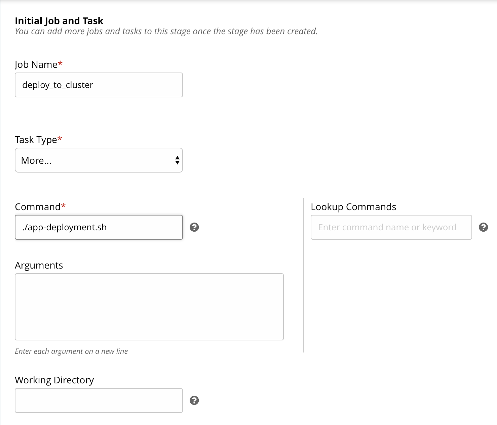
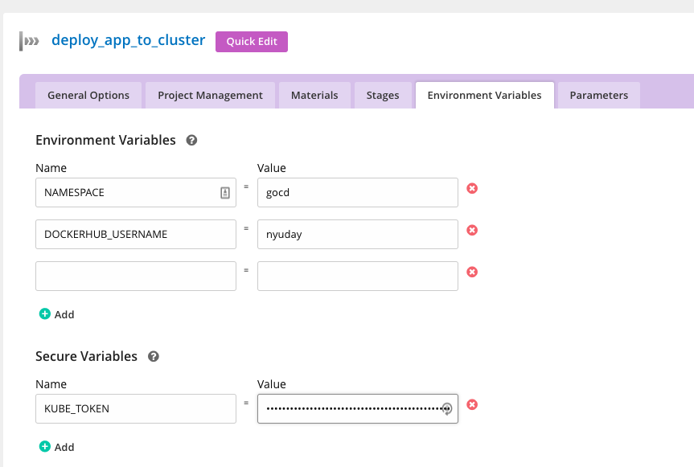
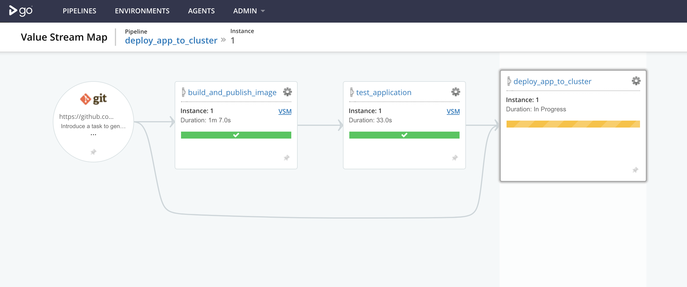
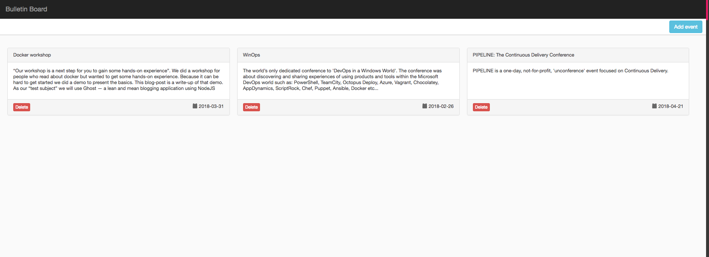

# Create a pipeline to deploy the published artifact

In this section, we’ll learn to design a deployment pipeline to deploy to Kubernetes. After you've designed and run the build pipeline, you'll see that for every successful build, a new image gets created with a new tag. To create a pipeline to deploy the published artifact, follow these steps:   

1. Navigate to Admin -> Pipelines and click on `Create a pipeline within this group`.

2. Specify the pipeline name as `deploy_app_to_cluster`.

    

3. Specify the git material with URL `https://github.com/bdpiparva/node-bulletin-board`.

    

4. Create a stage named `deploy_to_cluster`.

    

5. Create the initial job `deploy_to_cluster`. The initial task argument is

    `sed -i "s/##{image}/$DOCKERHUB_USERNAME\/bulletin-board:$GO_DEPENDENCY_LABEL_UPSTREAM/" bulletin-board-deployment.json`

    *Note the extra '#'. GoCD offers additional environment variables (like $GO_DEPENDENCY_LABEL_*)to use in builds when a pipeline depends on another pipeline. We'll look at how to configure a dependency in the next step.*

    

6. Introduce the pipeline `build_and_publish_image` as a material called `upstream`. 

    We want to add the earlier pipeline to build the app as a dependency as we want this pipeline to run only after the docker image is built. 
    
    

7. Add the `NAMESPACE`, `DOCKERHUB_USERNAME` and `KUBE_TOKEN` environment variables.

    > The `KUBE_TOKEN` environment variable is needed when we make a Kubernetes API requests to create deployments, service and ingress.
    For convenience, you can use the secret associated with the service account we used to start the `Tiller` pod: `kube-system:default`.  

    ```bash
    kubectl describe sa default --namespace kube-system // to obtain the secret name
    kubectl describe secrets <token_name> --namespace kube-system
    ```

    

8. Configure a task to call the `./app-deployment.sh` script.

    

## Associate job with the elastic profile

*Note: You’ll need to make sure you have [created an elastic profile](elastic_profiles.md) before you proceed.*

Before you can run the pipeline, you’ll need to associate an elastic profile ID with the job to be executed. To do this, go to the `Job Settings` tab of the specific job.

*Tip: Use the tree on the left to navigate to the job `deploy_to_cluster`. Once you're here, you can associate the profile ID under the Job Settings tab.*

Once you’ve associated the job to the profile, you’re ready to run the pipeline.


## Run your pipeline

Now that the deploy pipeline is configured, we can run it and verify that the deployment has been completed.

> To run the pipeline, `unpause` the pipeline in the GoCD dashboard. The changes in the source git repository get picked up automatically when the pipeline is triggered.

## View the value stream map

You can view the value stream map of your deployment by clicking on the 'VSM' link of the `deploy_app_to_cluster` pipeline in the Dashboard. 



## Access your application

Once the pipeline has run successfully, go to `<ingress-ip>/bulletin-board` to see your deployed sample application.

Get the new ingress IP address for the application by doing

```bash
kubectl get ingress bulletin-board-ingress --namespace <NAMESPACE>
```

*Note: On minikube, the ingress IP will remain the same as the GoCD server IP.*


