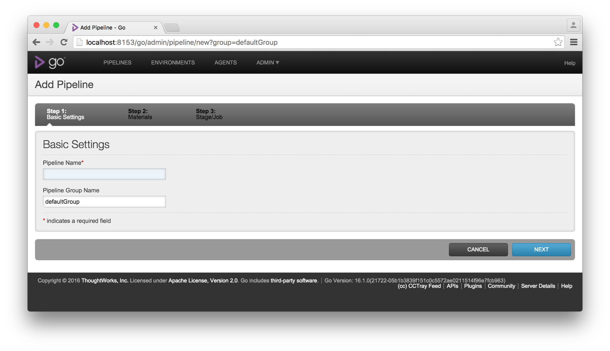
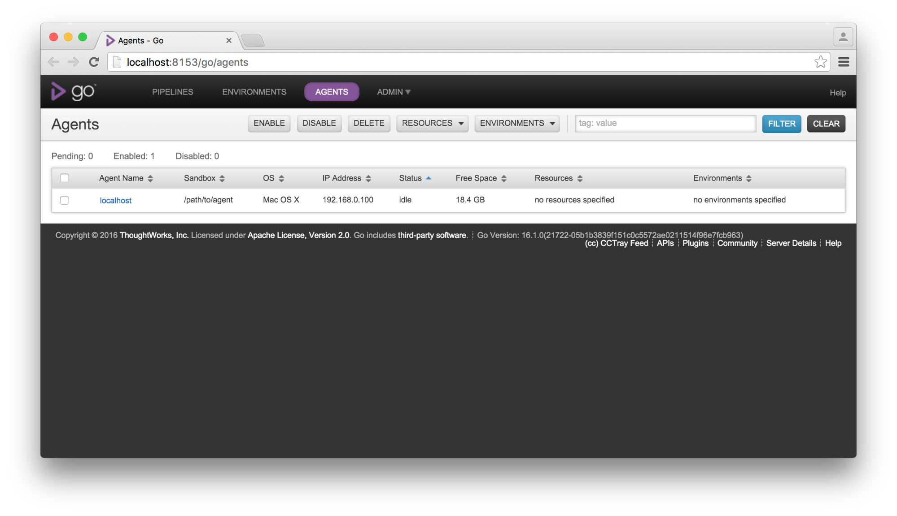

# Installing GoCD

GoCD consists of two installable components. The GoCD Server and one or more GoCD Agents. They have a one-to-many
relationship in that many GoCD agents can connect to one GoCD Server. To do any real work, you need at least one agent,
since agents are the real builders or work executors in the system.

Since installation instructions vary per operating system, the installation instruction pages linked below will ask you
to choose your operating system and then provide you instructions for that operating system.

##### Go to: [GoCD Server installation instructions](installing_go_server.md)

##### Also, go to: [GoCD Agent installation instructions](installing_go_agent.md)

Whatever operating systems you install the GoCD server and (at least one) GoCD agent on, the default ports used by the
server are 8153 (HTTP port) and 8154 (HTTPS port). So, after installation you should be able to access either
http://localhost:8153 or http://your-server-installation-hostname:8153 and you should see a screen
such as this:

Once the agent is started, switching to the agents tab by clicking on the "Agents" link in the header should take you to
a screen where the agent shows up and is idle. Like this:

An agent or agents can be installed on any node, and not necessarily the node that the GoCD Server is installed on. The
only requirements are that ports 8153 and 8154 of the GoCD Server are accessible from the node that the agents are
installed on.

If you are still having trouble with the installation, take a look at the [troubleshooting guide](troubleshoot_installer.md).
