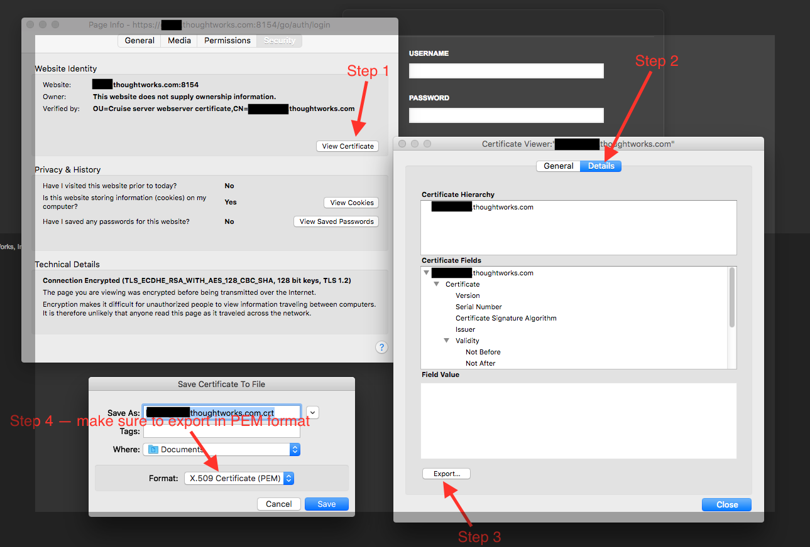

<!-- toc -->

# Configure end-to-end transport security

**Note:** To ensure end-to-end transport encryption, please ensure that both your GoCD server and agent are running on atleast version 16.7.0

This section will help you configure and improve the security of the agent-to-server communication using correct SSL/TLS certificates and verification process.

The GoCD agent allows for some configuration to be able to configure and secure the end-to-end transport security to varying security levels.

The agent by default trusts any and all certificates offered to it, which may possibly allow for MITM attacks. If you'd like to improve security further, by providing your own server certificate, you may provide one of the following options before starting the agent process.

`java -jar agent-bootstrapper.jar -serverUrl https://ci.example.com:8154/go [-rootCertFile /path/to/root-cert.pem] [-sslVerificationMode FULL|NONE|NO_VERIFY_HOST]`

## The `-rootCertFile` option

The `-rootCertFile` option must point to the root certificate from the GoCD server (If you're using a certificate signed by a known CA, you may not need to pass the rootCertFile if the root certificate is present in the default JVM trust store). You can export it from firefox using the [page info window](https://support.mozilla.org/en-US/kb/page-info-window-view-technical-details-about-page#w_security) by clicking "export" from the certificate details page as shown below: 



If you have the openssl binary available then you can also run the command below to export the root certificate from the GoCD server:

```
openssl s_client -showcerts -connect HOSTNAME:PORT </dev/null 2>/dev/null|openssl x509 -outform PEM
```


## The `-sslVerificationMode` option

The `-sslVerificationMode` option allows you to choose the level of verification you'd want.

* `NONE` (the default) will disable all SSL/TLS verification.
* `NO_VERIFY_HOST` will perform certificate check, but ignore verification of the server hostname.
* `FULL` will perform complete certificate validation.


# Configuring the agent

## Windows

### If you're running the GoCD agent as a windows service

Edit the file (if it already does not exist) `GO_AGENT_INSTALL_DIR/config/wrapper-properties.conf` and add the following properties to it

```shell
# config/wrapper-properties.conf

# set the ssl verification mode
wrapper.app.parameter.4=-sslVerificationMode
wrapper.app.parameter.5=FULL

# set the ssl root cert path (if the server is using a certificate that is not signed by a well known certificate-authority)
wrapper.app.parameter.6=-rootCertFile
wrapper.app.parameter.7=C:\Path\To\root-cert.pem
```

### If you're running the GoCD agent via a batch file

Setup the system environment `AGENT_BOOTSTRAPPER_ARGS` before running the batch file. You may either `set` it from the command line, or if you'd like to make the change permanent, you may choose to set it from the "**Advanced system settings**" dialog from "**Control Panel**".

```bash
C:\> set AGENT_BOOTSTRAPPER_ARGS=-rootCertFile C:\Path\To\root-cert.pem -sslVerificationMode FULL
C:\> agent.cmd
```

## Linux

### If you're running the GoCD agent as a service

Edit the file `/etc/default/go-agent` and add the following lines to it

```bash
# /etc/default/go-agent

AGENT_BOOTSTRAPPER_ARGS="-rootCertFile /path/to/root-cert.pem -sslVerificationMode FULL"
```

### If you're running the GoCD agent from the command line

```bash
$ export GO_SERVER_URL='https://ci.example.com:8154/go'
$ export AGENT_BOOTSTRAPPER_ARGS="-rootCertFile /path/to/root-cert.pem -sslVerificationMode FULL"
$ ./agent.sh
```
