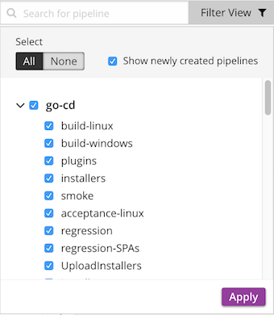

# Pipelines Dashboard in GoCD

This shows the current activity in the system. You can see all the instances of a given pipeline that are currently in progress.

### Key

1.  The pipelines are listed under the pipeline group that they belong to
2.  Click the pipeline name to see [pipeline activity](../navigation/pipeline_activity_page.md) for that pipeline.
3.  Click pipeline instance label to see details for that instance.
4.  Click on each stage segment to see [stage details](../navigation/stage_details_page.md) for that stage instance.
5.  "triggered by [user name] about [how long ago]" gives you a quick look at who activated this pipeline and when this was triggered.
6.  The "Trigger" button forces a pipeline to begin build activity
7.  The [Trigger with Options](../advanced_usage/trigger_with_options.md) button allows the you to pick the revisions of materials that the pipelines should build with, and trigger the pipeline.
8.  The "Pause" button pauses scheduling of the pipeline.
9.  The "Changes" shows you the modifications to materials that have been built in this instance. The "!" indicates that the changes are being built for the first time.
10. "previously:[status]" tells you what the status of the currently running stage in the previous pipeline instance was. The previous instance is based on [natural ordering](../faq/ordering_of_pipelines.md). On hover, you can see the label of the 'previous' pipeline instance.
11. This shows you the name and status of the last executed stage in that pipeline instance.
12. View all changes between the current pipeline instance with the previous one.
13. Lets you customize which pipelines are displayed on the dashboard. See [below](#personalize-pipelines-view) for more details.
14. Lets you search for any pipeline configured to be visible on your pipeline dashboard.
15. If you are a GoCD pipeline group administrator or a super administrator, you can now navigate to edit a pipeline by clicking this settings icon on the pipeline dashboard or the environments page.

### Personalize pipelines view

You can customize and control the pipelines you see on the dashboard by using the "Personalize" button on your dashboard. You can choose which pipelines you want to see, in this list, and save your selection by clicking on the "Apply" button. From that point onwards, the pipelines dashboard will only show your selections.

However, at a later point, if a new pipeline is added by someone else, that pipeline shows up on your dashboard as well. Uncheck the "Show newly created pipelines" checkbox to prevent them from showing up on your dashboard.

Pipelines created by you using the pipeline creation wizard will always be shown on your dashboard. You can remove them from your view after they are created.

##### Also see...

-   [Pipeline activity](../navigation/pipeline_activity_page.md)
-   [Job details](../navigation/job_details_page.md)
-   [Clean up after canceling a task](../advanced_usage/dev_clean_up_when_cancel.md)
-   [GoCD overview](../introduction/concepts_in_go.md)
