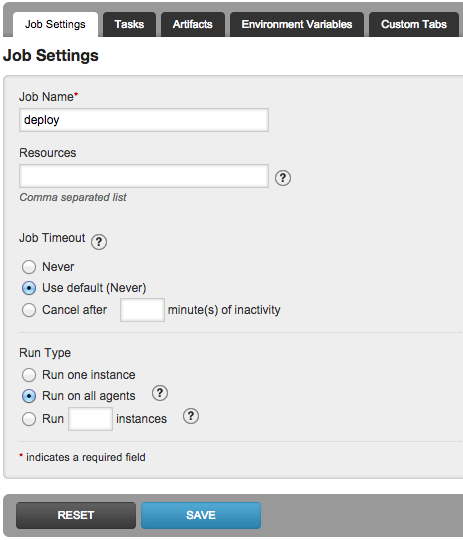
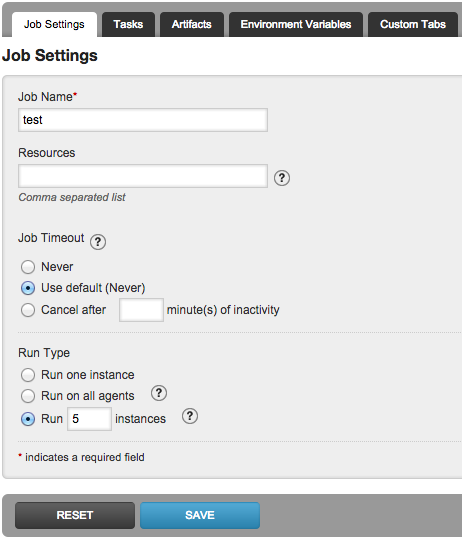

## Run a Job on a group of Agents

Sometimes there is a particular job that you may wish to run on all agents in an environment, or in all agents that match a certain resource tag. For example you may want to run a system update on all linux agents, or install a new piece of software.

Go will run the Job on all agents that match the environment and resources specified in the job.

If an agent is missing or lost contact, a job will be scheduled. When the agent comes back on line, the job will be re-scheduled.

Jobs are given a unique name based on the name of the job in the configuration file. So for example, if the job is called 'deploy' and you have two agents, you would see jobs like 'deploy-runOnAll-1' and 'deploy-runOnAll-2'.

### Configure through the Admin UI

To enable run on all agents for a job, navigate to the Job settings page in the job configuration



### Configure through the Config XML

To specify that a job should run on all agents, add the attribute

``` {.code}
runOnAllAgents="true"
```

to the job's definition (see configuration reference for [`<job>`](../configuration/configuration_reference.md#job))

``` {.code}
<job name="run-upgrades" runOnAllAgents="true">
    ...
</job>
```

## Run 'X' instances of a Job

If you want to run multiple instances of the same job configuration you do not have to maintain multiple copies of same job config. You can specify how many instances of job you need & Go will take care of spawing the required number of job instances during scheduling.

This feature is particularly usefull for test parallelization. It enables Go users to integrate with other test parallelization tools like [TLB](test-load-balancer.github.io) etc. to achieve distributed test execution with minimal configuration.

Jobs are given a unique name based on the name of the job in the configuration file. Example, if the job is called 'test' and you have set runInstanceCount to 2, you would see jobs like 'test-runInstance-1' and 'test-runInstance-2'. Go provides index of job (GO_JOB_RUN_INDEX) & total count of jobs (GO_JOB_RUN_COUNT) as environment variables to each Job.

### Configure through the Admin UI

To run 'x' instances of a job, navigate to the Job settings page in the job configuration



### Configure through the Config XML

To specify that 'x' instances of a job should run, add the attribute

``` {.code}
runInstanceCount="5"
```

to the job's definition (see configuration reference for [`<job>`](../configuration/configuration_reference.md#job))

``` {.code}
<job name="run-tests" runInstanceCount="5">
    ...
</job>
```


#### Also See...

-   [Re-running job(s)](../faq/job_rerun.md)