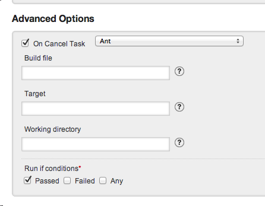

# Clean up after canceling a task

When you have jobs that take a long time to run, it is very useful to have the capability to cancel it when you already know it will fail.

By default, Go will **kill any currently running tasks** . There are two other alternatives to this behaviour

-   Specify a task to clean up your environment. This could kill the processes and cleanup any existing state.
-   Indicate to Go you do not want anything done. This will allow the task to finish executing so the agent does not get into an inconsistent state.

## Using web interface

To perform a custom cleanup through the web interface, edit the desired **task configuration** and check the **On Cancel Task** checkbox in **Advanced Options**

## Using XML configuration

### Example: Override task to perform custom cleanup

Usage: As a developer, I want to stop running my [Twist](http://www.thoughtworks.com/products/twist-agile-testing) tests and clean up the environment on each job when I cancel the stage.

-   On the [Administration Tab](../navigations/administration_page.html), edit the jobs that should handle canceling correctly
-   Ensure the following "task" block is in the job configuration
-   Now, whenever you cancel the stage while the jobs are running the ant "twist" target, the target "kill\_twist" will execute

### Example: Override task to disable all cleanup

Usage: As a developer, I want to allow my database tests to not be halted when I cancel the stage.

-   On the [Administration Tab](../navigations/administration_page.html), edit the jobs that should handle canceling correctly
-   Ensure the following "task" block is in the job configuration
-   Now, whenever you cancel the stage while the jobs are running the rake "db-test" target, the agent will finish the task before picking up new work