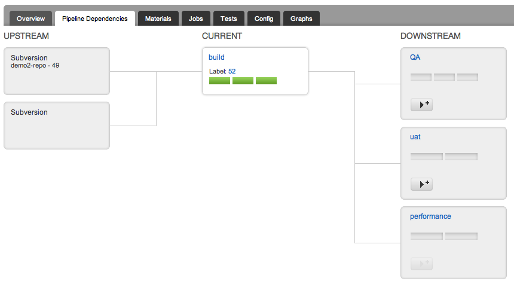
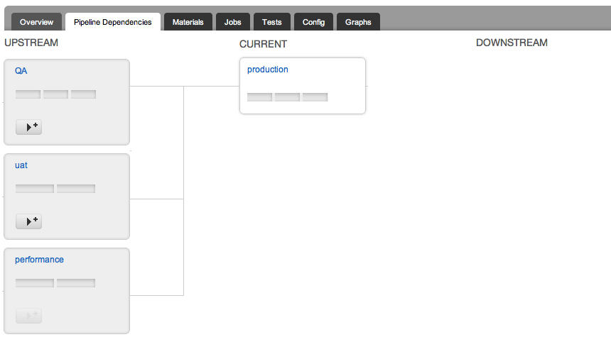
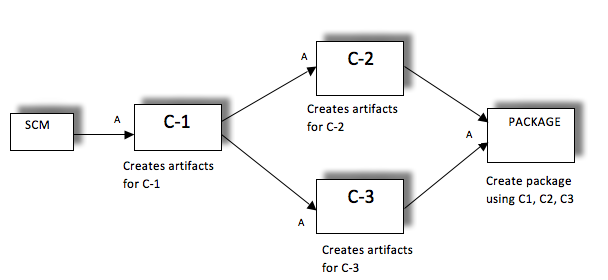
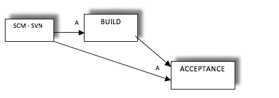
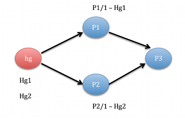

# Fan-in Dependency Management

Go supports fan-in dependency resolution for pipelines that are on auto trigger. Fan-in material resolution will ensure that a pipeline triggers only when all its upstream pipelines have triggered off the same version of an ancestor pipeline or material. This will be the case when you have multiple components building in separate pipelines which all have the same ancestor and you want downstream pipelines to all use the same version of the artifact from the ancestor pipeline.

When you have non trivial pipeline dependency graphs, significant differences in pipeline execution times and automatic builds/deployments, you may typically run into the following issues

-   **Wasted builds** : Premature runs which do not have the right version of dependent components because one of the dependent pipelines was faster than the rest.
-   **Inconsistent results** : Your deployment that depends on multiple components may have incompatible versions of components because the build times of these components are different
-   **Incorrect feedback** : Your deployment to Production should happen only when it has successfully passed the UAT, Staging and Pre-Prod environments but it was triggered prematurely as soon as UAT went green.
-   **Running code with the wrong tests** : Your commit to SCM contains both code and tests written for the code. Your pipelines are modeled such that your acceptance or test pipeline runs after the build pipeline. Acceptance has to run with the right tests for the code but instead it triggers as soon as the commit goes through with the previous available version for tests.

Go helps solve all of the above problems.

## How to use fan-in:

-   In cases where your SCM material is used throughout the process you will need to define the same URL for the material throughout. This will let Go know that it is a shared material and Go will enforce fan-in wherever applicable. For example: code, tests, environment configuration are in http://svn.company.com/code, http://svn.company.com/tests, and http://svn.company.com/config respectively. In this case ensure for pipelines that need these materials, the url is set to the same value. For example the pipelines Build, Acceptance and Deploy have the material url http://svn.company.com
-   Pipelines where fan-in dependency resolution is required will need to have trigger type set as auto

## Example use cases for fan-in resolution

### Creating a gate to production

I want to push a build into a number of environments in parallel (Manual QA, UAT for business sign off and performance testing) so that all these activities happen at the same time. So we have a pipeline dependency model as shown below



For the next step, when deploying to production, we have a pipeline that depends on all 3 of the above pipeline so that a build that has succeeded in all 3 environments is automatically pushed to production. This is shown below.



Sequence of Events and Resolution

-   A new build is generated.
-   The build is pushed to QA, UAT and performance pipelines.
-   Regardless of the time taken in each of these pipelines, Go will ensure that production is triggered only after all three pipelines go green with the same version of build. Production will use the right version of your build artifacts.

How to configure:

-   Production should have trigger type as auto.
-   QA, UAT and Performance should have Build as a material. Trigger type for these pipelines can be either manual or auto.

### Picking the right version of dependent components

I have three component pipelines (C1, C2, C3) and a package pipeline that fetches their artifacts and creates a deploy package. Components C2 and C3 depend on pipeline C1 and have it as a material. The pipeline for C2 builds quickly but C3 takes a while. So we have a pipeline dependency model as shown below



The package pipeline should not trigger as soon as C2 is done. It should trigger only if both C2 and C3 go green. Additionally Package should use the same version of C1 that was used by C2 and C3.

Sequence of Events and Resolution

-   C1 is triggered on a change.
-   C2 and C3 are triggered after C1 is successful.
-   C2 builds quickly but C3 is still in Progress.
-   Go resolves that C3 and C2 depend on a common ancestor C1. Hence Go will wait for C3 to finish.
-   If C3 goes green, the Package pipeline will trigger. It will use the right versions of C1, C2 and C3.

How to configure:

-   Add C1 as a material for pipelines C2 and C3
-   Add C2 and C3 as materials for pipeline Package.
-   Package should have trigger type as auto

### Test source code with the right version of tests

You check-in code and tests as part of the same commit. The build pipeline compiles code and creates an artifact. The Acceptance pipeline fetches the build artifact and runs the tests that were written for the compiled code. Acceptance has to use the same tests committed with the code. So we have a pipeline dependency model as shown below



Sequence of Events and Resolution

-   On committing the changes, the Build pipeline will trigger with the latest revision.
-   Although Acceptance also has the same material dependency, Go will not trigger it immediately.
-   Build pipeline executes successfully.
-   Acceptance will now trigger with the same version of the SCM and fetch the right build artifact from the Build pipeline.

How to configure:

-   Add the same SCM material to pipelines Build and Acceptance i.e the same URL.
-   Pipelines Build and Acceptance have trigger type as auto.

## Limitations

-   **Fan-in and blacklist** : If the pipelines contributing to the fan-in have blacklist in their material definitions, the target pipeline does not adhere to fan-in behavior.

    

    For example, refer to the scenario above. P1 and P2 are two pipelines which use the same mercurial (hg) repository, with two folders say "p1" and "p2". P1 is configured with "p2" folder in the blacklist. Likewise P2 is configured with "p1" folder in the blacklist.

    The first run of P1 happens when a check-in happens in "p1" folder. The first run of P2 happens when there is a check-in to "p2".

    In this scenario, P3, which is dependant on P1 and P2 does not trigger.

## Notes

-   Fan-in as a feature is enabled by default. In case you need pipelines to trigger with every version regardless of ancestor versions you can disable fan-in. To disable fan-in you will need to add a system property and restart the Go server. On linux add the following line to /etc/default/go-server

    ``` {.code}
    export GO_SERVER_SYSTEM_PROPERTIES='-Dresolve.fanin.revisions=N'
    ```

    On windows, in the config folder of the Go server installation, edit the wrapper-server.conf file, and add an additional property with the value '-Dresolve.fanin.revisions=N'. For example:

    ``` {.code}
    wrapper.java.additional.17='-Dresolve.fanin.revisions=N'
    ```

-   Go will apply fan-in dependency resolution for pipelines that have auto trigger type only.