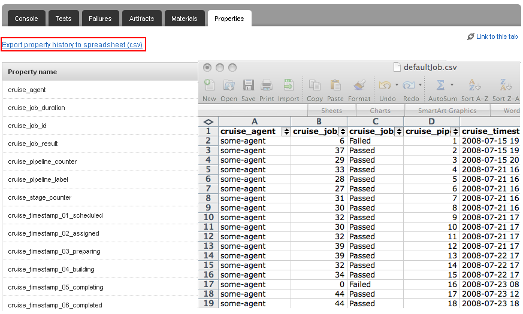
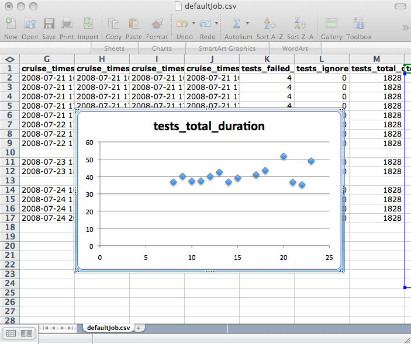

Help documentation
==================

 

Properties {.collapsible-heading onclick="toggleCollapse($(this));"}
==========

### Introduction {.collapsible-heading onclick="toggleCollapse($(this));"}

Properties provide a simple way of collecting metrics over time. Go sets
some standard properties for you. You can also set properties yourself
using the Go REST APIs (see [Properties API](Properties_API.html) for
more information). Go also allows you to download the history of your
job in a convenient CSV format, so that you can analyse the results in
spreadsheets or scripts.


### Property history {.collapsible-heading onclick="toggleCollapse($(this));"}

Go allows you to download the history of properties that you have
defined. This history is available as a Comma Separated Values (CSV)
file. You can import this file into a spreadsheet program to generate
charts and diagnostics of your project.

You can of course access these resources through standard URLs:

-   **CSV** --
    http://[server]/go/properties/[pipelineName]/[pipelineLabel]/[stageName]/[stageCounter]/[job]/[propertyName]

To open the property history in a spreadsheet application, you can click
on the **Export property history to spreadsheet (csv)** link on the
Properties tab of the job.




### Standard Properties {.collapsible-heading onclick="toggleCollapse($(this));"}

The standard properties defined by Go are:

-   **cruise\_agent** -- the agent that is running the job
-   **cruise\_job\_duration** -- total time to run the job
-   **cruise\_job\_result** -- one of "passed" or "failed"
-   **cruise\_job\_id** -- the name of the folder that the artifacts of
    the job was stored in under the artifact repository on server side
    (on earlier versions of Go).
-   **cruise\_pipeline\_label** -- same as the value of the environment
    variable GO\_PIPELINE\_LABEL
-   **cruise\_pipeline\_counter** -- same as the value of the
    environment variable GO\_PIPELINE\_COUNTER
-   **cruise\_stage\_counter** -- same as the value of the environment
    variable GO\_STAGE\_COUNTER
-   **cruise\_timestamp\_01\_scheduled** -- time at which the job was
    scheduled
-   **cruise\_timestamp\_02\_assigned** -- time at which the job was
    assigned to the agent
-   **cruise\_timestamp\_03\_preparing** -- time at which the job
    entered the "preparing" state
-   **cruise\_timestamp\_04\_building** -- time at which the job started
    building
-   **cruise\_timestamp\_05\_completing** -- time at which the job
    entered the completing state
-   **cruise\_timestamp\_06\_completed** -- time at which the job
    completed

### Generating Properties from Artifacts {.collapsible-heading onclick="toggleCollapse($(this));"}

Go allows you to generate properties from XML artifacts that you create
during the build. This can be used to harvest statistics produced by
coverage tools etc. By storing them as properties it becomes very easy
to show the history and trends over time of these values.

Note that the properties are generated on the agent side, so the src
path is relative to the working directory of the pipeline on the agent.

For example, to add support for the coverage tool "Emma", you might do
this:

``` {.code}
<job>  
  <properties>  
    <property name="coverage.class" src="target/emma/coverage.xml" xpath="substring-before(//report/data/all/coverage[starts-with(@type,'class')]/@value, '%')" />  
    <property name="coverage.method" src="target/emma/coverage.xml" xpath="substring-before(//report/data/all/coverage[starts-with(@type,'method')]/@value, '%')" />  
    <property name="coverage.block" src="target/emma/coverage.xml" xpath="substring-before(//report/data/all/coverage[starts-with(@type,'block')]/@value, '%')" />  
    <property name="coverage.line" src="target/emma/coverage.xml" xpath="substring-before(//report/data/all/coverage[starts-with(@type,'line')]/@value, '%')" />  
  </properties>
</job>
            
```

### Tests {.collapsible-heading onclick="toggleCollapse($(this));"}

If you define a tests artifact that contains the test reports, then Go
will add some properties associated with the tests.

-   **tests\_failed\_count** -- number of failed tests
-   **tests\_ignored\_count** -- number of ignored tests
-   **tests\_total\_duration** -- total time taken for the tests
-   **tests\_total\_count** -- total number of tests


Your search did not match any help pages.


© ThoughtWorks Studios, 2010

