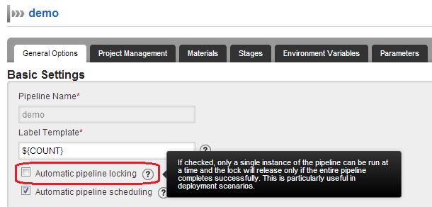

#Ensure only one instance of a pipeline can run at the same time

Sometimes you want to ensure that only a single instance of a pipeline can run at a time. This is important if the stages of a pipeline are interrelated. For example the first stage may set up an environment that is used by the next stage in the pipeline.

If a pipeline is locked then Go will not allow any other instance of that pipeline to be scheduled until the currently running one has been completed.

To enable locking from the Config UI, navigate to the General Options section of pipeline.



To enable locking from the Config XML set the isLocked attribute to true

```
<pipeline name="my-locked-pipeline" isLocked="true" >
    <materials>
        ...
    </materials>
    <stages>
        ...
    </stages>
</pipeline>
```

Also see the [configuration reference](configuration_reference.md#pipeline).