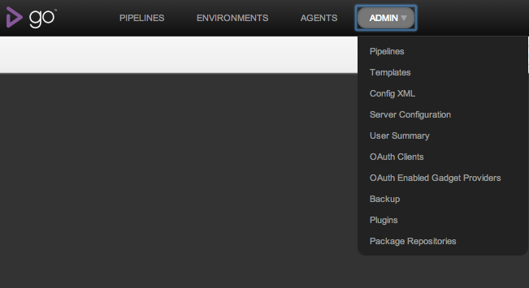
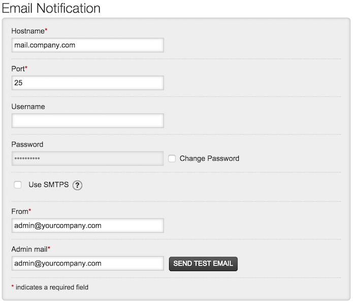

#Mailhost information

In order to allow [email notifications](dev_notifications.md), you need to tell Go information about your mailhost.

-   Click on the [Administration](../navigation/administration_page.md) tab

-   Click on the 'Server Configuration' sub-tab
-   Add your mailhost information (with username and password as required)

-   Add an Administrator email address (this account will be emailed if the Go server is [running out of disk space](../faq/admin_out_of_disk_space.md))
-   Click 'Send test email' to verify the configuration is working correctly
-   Click 'Save' when you're sure it's working.

<a name='starttls'></a>
# SMPTS and TLS

Depending on the way your email server is setup, you might need to enable TLS or SMTPS setup in Go, to get it to send emails properly. Please ask you administrators for information about the setup of your email server.

To make Go change the protocol to use SMTPS, while connecting to the email server, just enable the "Use SMTPS" setting shown in the image above. Most often, but not always, this setting is used in conjunction with port 465.

If your email server uses STARTLS, then you need to pass in the ```mail.smtp.starttls.enable``` Java system property to Go, to enable support for it. This is done by providing the command-line argument ```-Dmail.smtp.starttls.enable=true``` during startup (into the GO_SERVER_SYSTEM_PROPERTIES part of /etc/default/go-server, for instance). Most often, but not always, this setting is used in conjunction with port 587, and with the "Use SMTPS" option turned off.
