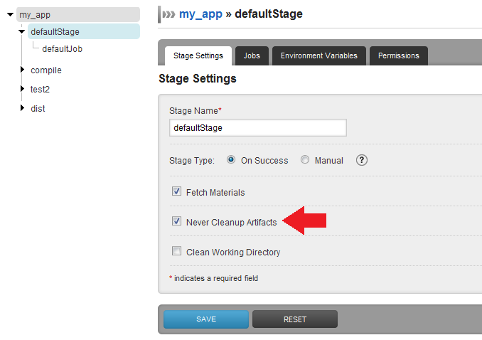

# Auto delete artifacts

## Introduction

Go can be configured to automatically delete artifacts if the available disk space on the server is low. Go will purge artifacts when available disk space is lower than the given value. Artifacts will be purged upto the point when available disk space is greater than a defined value.

## Configuration

### Specify artifact purge start and end limits

You must be logged in as an admin user to configure this step.

1.  Navigate to the Admin section on the Go dashboard.
2.  Navigate to the Pipeline Management sub-section
3.  Specify when Go should begin to purge artifacts in the first edit box.
4.  Specify when Go should stop purging artifacts in the second edit box.

### Never delete artifacts for a stage

You must be logged in as an admin user to configure this step.

You can disallow deletion of artifacts from a particular stage so that those artifacts are excluded during deletion. This option can be set in the stage editor for a pipeline. This option can be set for stages that are important so that artifacts for the stage are preserved.

1.  Navigate to the admin section on the Go dashboard.
2.  Navigate to the pipelines section and choose a pipeline to edit
3.  Navigate to the stage settings for the stage

4.  Check the box 'Never Cleanup Aartifacts'

### Also see...

-   [Managing artifacts and reports](managing_artifacts_and_reports.md)
-   [Clean up after cancelling a task](../advanced_usage/dev_clean_up_when_cancel.md)