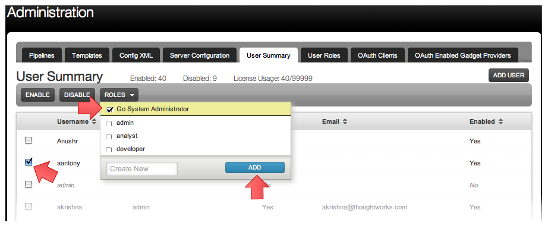
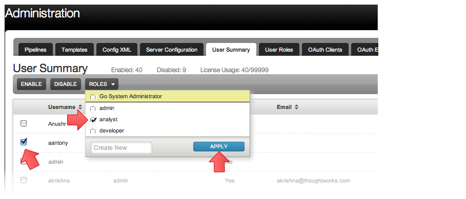
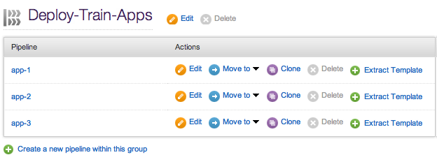
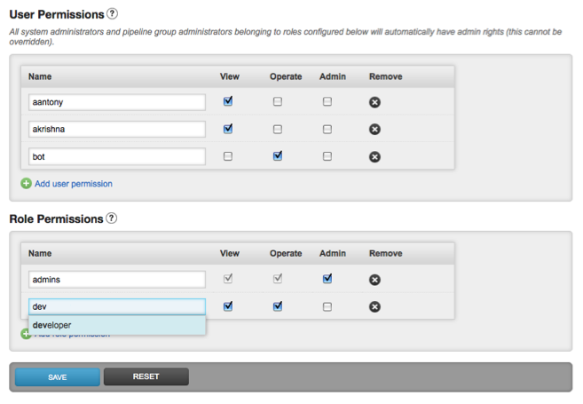
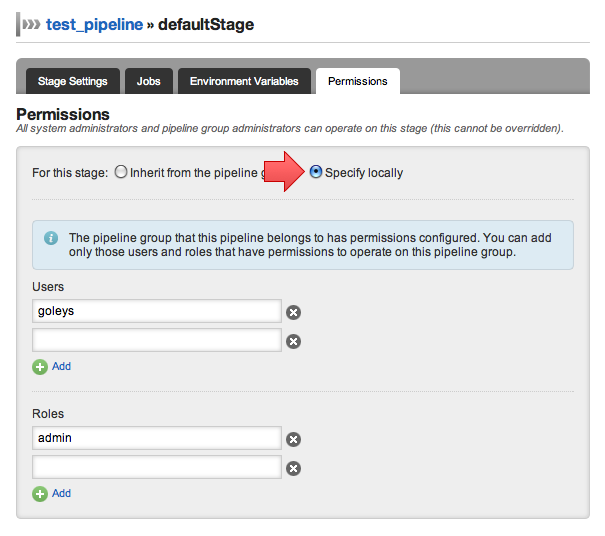

# Authorization

With no security switched on, there is of course no authorization either. Once you have configured security, the default is that any user can perform any operation. However you can get Go to limit certain operations to particular Users or Roles, and manage membership of those Roles.

## Administrators

Go allows you to restrict the users who can perform certain functions. Administrators is a special role that allows its members to perform any action in Go. Specifying administrators is optional -- without it, all users are automatically made administrators.

If administrators are specified, only they can perform the following actions:

-   Access the "administration" tab
-   Add/Edit Pipeline Templates
-   Enable agents
-   Add / remove agent resources

Users can be made administrators from the "User Summary" tab in the "Admin" section.



To give admin privileges to users and/or roles via "Config xml", please refer to the example in the section below, where members of the "go\_admin" role (jhumble and qiao), along with the user chris, can administer Go.

## Role-based security

You can define roles that can be used anywhere that authorization is required. A role is just a group of users. Administrators can add users to a new or existing role from the "User Summary" tab in the "Admin" section. Here, you can select any number of users and assign a new or existing role to them. In this example, user "aantony" is being added to the role "analyst"



For power users, here's how you would configure roles via "Config XML":

``` {.code}
<cruise>
  <server>
    <license ... />
    <security>
      <passwordFile path="/etc/go-server/passwords.properties" />

      <roles>
        <role name="qa">
          <user>dyang</user>
          <user>pavan</user>
        </role>
        <role name="go_admin">
          <user>jhumble</user>
          <user>qiao</user>
        </role>
      </roles>

      <admins>
        <role>go_admin</role>
        <user>chris</user>
      </admins>
    </security>
  </server>
</cruise>
      
```

In this example, the "qa" role has two users: dyang and pavan. The "go\_admin" role also has two users: jhumble and qiao.

## Specifying permissions for pipeline groups

Go allows you to group pipelines together. If you define pipeline groups, you can specify who is able to view or operate those groups. To do this, you configure permissions to the pipeline group. System administrators will continue to have full access to the pipeline group even if they have not been explicitly granted permissions.

The **"view" permission** allows users to view the pipeline. It does not give permission to trigger pipelines, approve stages, or re-run stages. In the below example, the users "akrishna" and "aantony" can view the pipelines in this group, but they cannot perform any operations on it.

The **"operate" permission** allows users to trigger pipelines and its stages. In the below example, the role "developer" is being granted the operate permission and will be able to trigger pipelines and its stages within this group.

The **"admin" permission** makes the user a [Pipeline Group Administrator](delegating_group_administration.md) allowing him to view, operate and administer the pipeline group. In the below example, role "admins" has been granted this permission.

> Note that is is possible to give a user or role only the operate permission. In the example below, the user "bot" only has operate permission. That means they can not view the pipeline, they can only operate it. This can be used to enable a script to operate on pipelines via the APIs without letting that user access any other features of Go.

To edit the permissions for a pipeline group, navigate to the "Pipelines" tab on the "Admin" section:



Then, click the "Edit" link for the pipeline group you want to manage permissions for:



If no authorization is defined for a pipeline group, all Go users will have view and operate permissions to that group.

For power users, here's how you would configure permissions via "Config XML":

``` {.code}
<pipelines group="Shine">
  <authorization>
    <view>
      <user>aantony</user>
      <user>akrishna</user>
      <role>developer</role>
    </view>
    <operate>
      <user>bot</user>
      <role>developer</role>
    </operate>
    <admins>
      <role>admins</role>
    </admins>
  </authorization>
  ...
</pipelines>
```

## Adding authorization to approvals

In Go, it is possible to specify [manual approvals](managing_pipelines.md) between stages. You can also specify which user is allowed to trigger manual approvals.

The authorization can be inherited from the pipeline group this pipeline belongs to. But defining specific permissions overrides this. In the example below, only members of the role "admin", and the user "goleys", can trigger the approval.



For power users, here's how you would configure authorization for approvals for a stage via "Config XML":

``` {.code}
<stage name="defaultStage">

  <approval type="manual">
    <authorization>
      <role>admin</role>
      <user>goleys</user>
    </authorization>
  </approval>

  <jobs>
    <job name="deploy">
      <resources>
        <resource>uat</resource>
      </resources>
      <tasks>
        <ant target="deploy" />
      </tasks>
    </job>
  </jobs>
</stage>
  
```

## Specifying permissions for templates

A Go Administrator can make any user a template administrator for a specific template. As a template administrator, a user can now view and edit the template to which he has permissions.

To edit the permissions for a template, navigate to the "Templates" tab on the "Admin" section:


Then, click the "Permissions" link for the template you want to manage permissions for:


For power users, here's how you would configure permissions via "Config XML":

``` {.code}
<templates>
    <pipeline name="app-1-template">
      <authorization>
        <admins>
          <user>operate</user>
        </admins>
      </authorization>
      ...
    </pipeline>
  </templates>
```

### Also See

-   [Delegating group administration](delegating_group_administration.md)