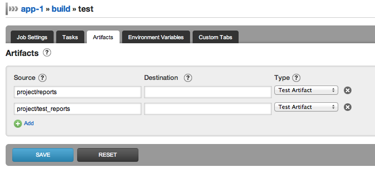
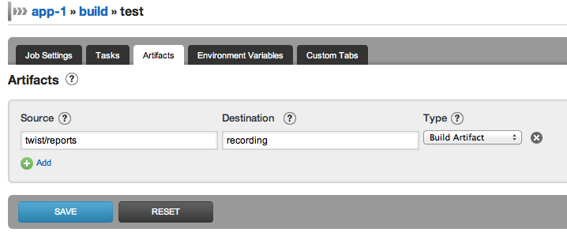
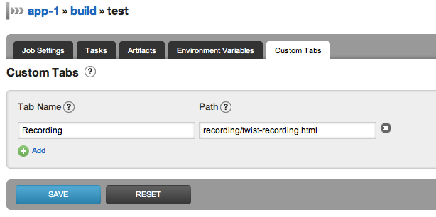

Help documentation
==================

 

Publishing artifacts {.collapsible-heading onclick="toggleCollapse($(this));"}
====================

When executing a job on an agent there are often artifacts created that
we need to keep around. For example, JUnit creates xml reports that Go
is able to parse in order to help you [understand why the build is
broken](dev_understand_why_build_broken.html). You can use Go with any
XUnit style xml reports. Or you might create a flash video of your UI
tests that we want displayed in Go. You can upload any html file from
your build and view it in Go.

To publish artifacts you add a an
[\<artifact\>](configuration_reference.html#artifact) to the job
configuration. More information can be found on the [Managing artifacts
and reports](../configuration/managing_artifacts_and_reports.html) page.

### Example usages {.collapsible-heading onclick="toggleCollapse($(this));"}

#### Uploading JUnit xml reports {.collapsed-heading onclick="toggleCollapse($(this));"}

We are going to assume that the JUnit test reports are being placed in
the "target/reports" folder.

Click on the **Administration** tab

Click on your pipeline

For each job that runs JUnit:

-   Click on the job name to edit job config
-   
-   Add the source of the test artifact. For tests, choose the type of
    artifact as Test artifact
-   
-   Click "Save"

#### Uploading a flash video and displaying it as a sub-tab {.collapsed-heading onclick="toggleCollapse($(this));"}

We are going to assume that the flash file, and the html file
referencing it, are being created in the "target/reports" folder.

Click on the [Adminstration](../navigations/administration_page.html) tab

Click on your pipeline

For each job that creates a flash video

-   Click on the job name to edit the job config
-   
-   Navigate to the "Artifacts". Add the source of the artifact. Choose
    the type of artifact as Build artifact. This will copy all files
    from the "target/reports" folder on the agent to the "Recording"
    folder on Go server
-   
-   Navigate to "Custom Tabs". Add the tab name and the source of the
    html file. This will create a tab called "Recording" that shows the
    html page found at "recording/twist-recording.html" on Go server.
-   
-   Click "Save"
-   [Watch the flash video as a sub-tab on the Job Details
    page](../faq/dev_see_artifact_as_tab.html)

© ThoughtWorks Studios, 2010

