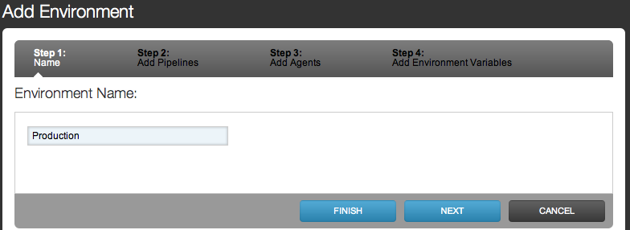
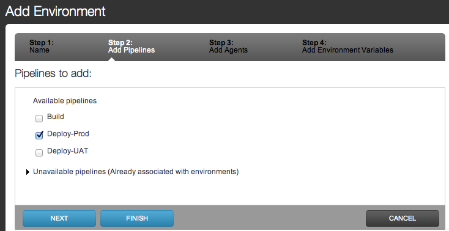
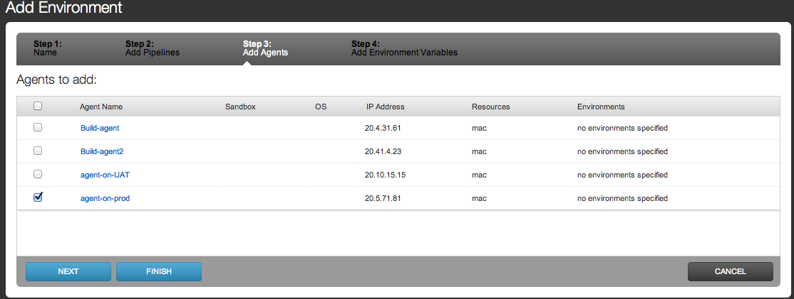
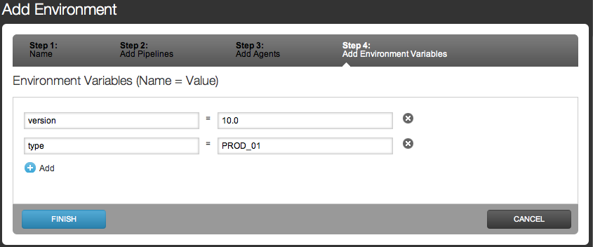
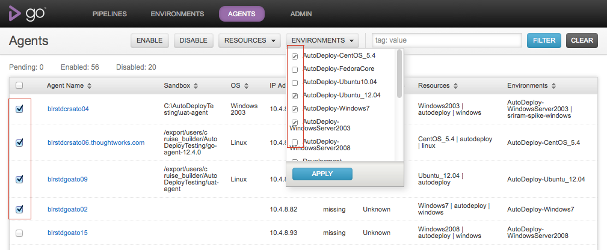

Help documentation
==================

 

Managing environments {.collapsible-heading onclick="toggleCollapse($(this));"}
=====================

Go is configured using an XML configuration file. This file can be
edited through the Go server dashboard. Go allows you to edit sections
of the configuration independently and will check the syntax of the
configuration before it saves it again. You can also edit the full XML
file if you wish, by clicking on the Config XML section of the
Administration tab.

### Creating a new environment {#create .collapsible-heading onclick="toggleCollapse($(this));"}

An Environment is a grouping of pipelines and agents. By assigning an
agent to an environment, it will be used to run only those jobs that
belong to the pipelines of that environment. An agent can belong to more
than one environment. This means, for instance, the same agent can be
used to deploy something into an UAT or a Performance testing
environment. A pipeline can, however, only be assigned to a single
environment. Generally, these pipelines represent the tasks that need to
happen in a given environment. For example deploying a 3-tier
application into an UAT environment with 6 machines and running smoke
tests on the setup.

However, once an agent is associated with one or more environments, it
is no longer capable of picking up jobs on pipelines that do not belong
to environments. Pipelines outside of environments will only be assigned
to agents in the default pool (not associated with any environment).

You can create an environment in the admin UI through the following
steps. This example creates a production environment, adding the
deployment pipeline and the agent installed on the production server.

-   Click on the Environments tab
-   
-   Click on the "Add a new environment"
-   
-   Provide a name for the environment
-   
-   Add one or more pipelines that need to run on the environment
-   
-   Add one or more agents associated with the environment
-   
-   Add one or more environment variables that need to be passed.
-   
-   Click on finish

Setting up an environment through the xml can be found in the
[configuration reference](configuration_reference.html#environments)

### Add a new agent to an existing environment {#agents .collapsible-heading onclick="toggleCollapse($(this));"}

You can do this very easily in the Agents tab. Just select the agents
you want to add to your environment and click on the Environments
button. All existing environments will appear in alphabetical order.
Select one of three states for all environments you want to add and then
click the “Apply” button.

-   An environment **with a check** will add the environment to all
    selected agents.
-   An environment **with a forward slash** means some of your selected
    agents are associated to it. No change will occur after clicking
    “Apply”.
-   An environment **without a check** will remove the environment from
    all selected agents.

© ThoughtWorks Studios, 2010

