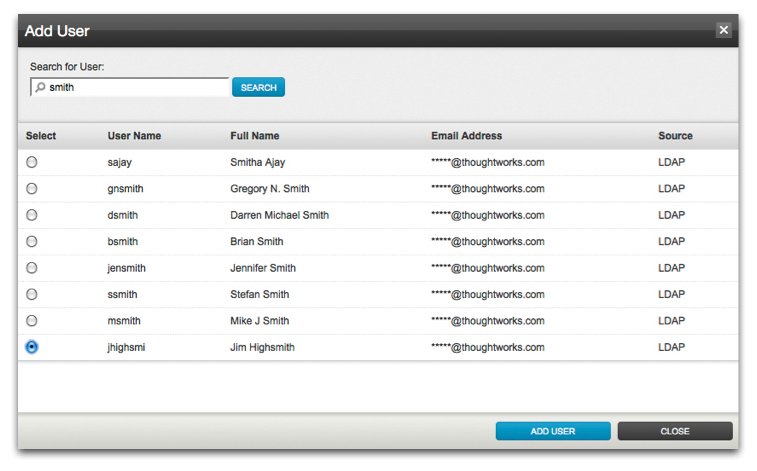
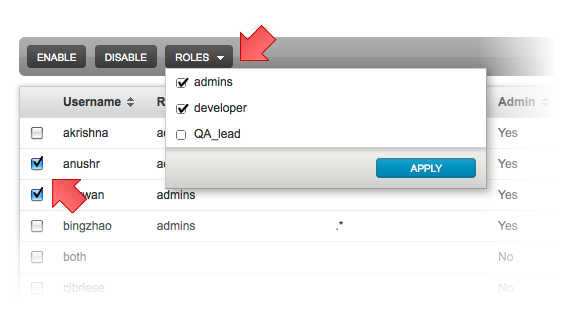

 

Managing Users<!-- {.collapsible-heading onclick="toggleCollapse($(this));"} -->
==============

Go's user management features allow you to control access to Go and
grant role-based permissions.

All user management features depend on an [authentication
mechanism](../configuration/dev_authentication.html) having been configured in Go. Please
ensure you have at least one [authentication
mechanism](../configuration/dev_authentication.html) enabled before attempting to use any
of the features mentioned in this chapter.

### Adding Users<!-- {.collapsible-heading onclick="toggleCollapse($(this));"} -->

1.  Navigate to the Admin section
2.  Click on the "User Summary" tab
3.  Click the "Add User" button

    

4.  Enter a name/email to search for (minimum 2 characters) and click
    "Search"
5.  This will perform a search across all authentication mechanisms
    configured (password file and/or LDAP)
6.  From the list of results, select the user to add and click "Add
    User"

### Assigning Roles<!-- {.collapsible-heading onclick="toggleCollapse($(this));"} -->

Roles allow you to group a set of users with similar functional duties
and grant them a common set of permissions.

For example, you may have 3 pipelines configured as part of your
workflow -- build, acceptance and deploy. You team may consist of 6
developers and 2 testers. With roles, you can group all 6 of your
developers into a role called "developers" and your 2 testers into a
role called "testers". You'd then assign the following permissions to
your pipelines:

-   build: Auto triggered pipeline with approval permissions granted to
    both developers and testers
-   acceptance: Auto triggered pipeline with approval permissions
    granted to testers only
-   deploy: Manually triggered pipeline with approval permissions
    granted to testers only

With this setup, your entire team has visibility into what each other is
doing, but you have controls around which role can do what.

**To assign roles to users:**

1.  Navigate to the Admin section
2.  Click on the "User Summary" tab
3.  Select the users you want assign roles to, or remove roles from
4.  Click the "Roles" button to see a list of roles
5.  Check/un-check the roles you want to assign/remove from the selected
    users and click "Apply"
6.  Alternately, you can create a new role to apply to the selected
    users by typing in the name of a role in the input box and clicking
    "Add"

### Managing 'Go System Administrator' privilege<!-- {.collapsible-heading onclick="toggleCollapse($(this));"} -->

'Go System Administrator' has access to all administrative functions,
and has operational access to all parts of a Go installation.

User management page allows you to assign admin privileges to or revoke
admin privileges from selected users.

This control allows you to modify admin privileges for users(not for
roles). Checking 'Go System Administrator' for selected users adds them
directly to \<admins/\> configuration tag. This control is disabled when
one or more of the selected users have implicit admin privilege through
role(s).

**Assign/Revoke 'Go System Administrator' privilege:**

1.  Navigate to the Admin section
2.  Click on the "User Summary" tab
3.  Select the users you want assign/revoke 'Go System Administrator'
    privilege.
4.  Click the "Roles" button to load 'Go System Administrator' control
5.  Check/un-check the 'Go System Administrator' checkbox and click
    "Apply"

© ThoughtWorks Studios, 2010

