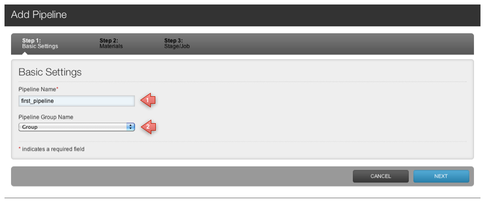
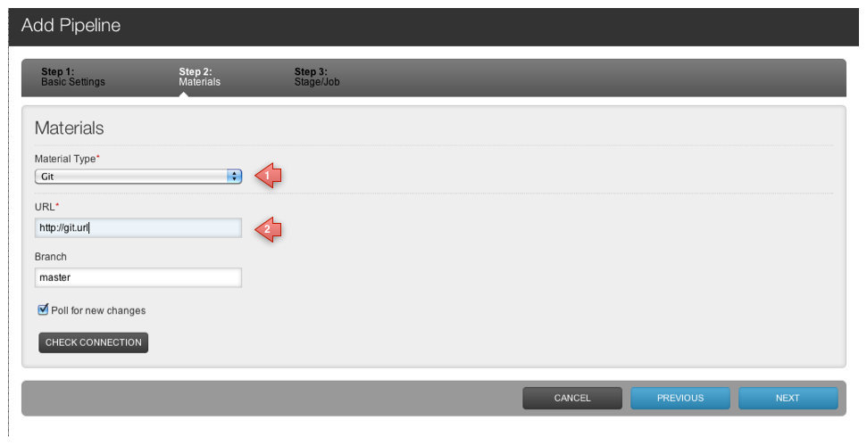
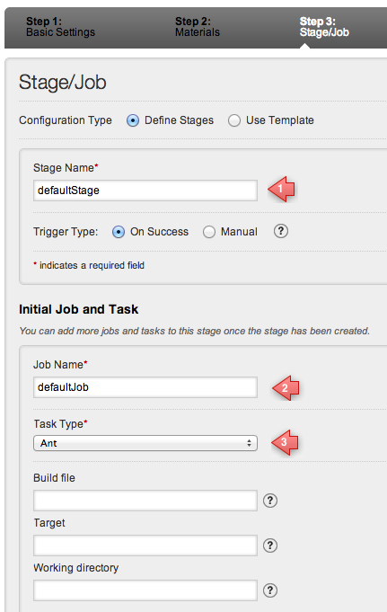

# Setup a new pipeline

## New Pipeline Wizard

After you've entered your license information, clicking on the **Pipelines** tab will take you to the "Add new pipeline" page. You can also add a pipeline by navigating to the Admin page and clicking on the "Create a new pipeline within a group" link. You can create a pipeline in 3 steps.

### Step 1: Basic Settings

1.  Fill in the pipeline name
2.  Fill in the pipeline group

### Step 2: Material

1.  Choose the material type. The material can be your Source Control Management (SCM or version control) repository or another pipeline or a [package repository](../extension_points/package_repository_extension.md) (e.g. [yum](../extension_points/yum_repository_poller.md)). Currently Go supports the following SCMs:
    1.  Subversion
    2.  Mercurial
    3.  Git
    4.  Team Foundation Server.

 and the package repository.

2.  Fill in settings specific to the material type.

### Step 3: Stage and Job

A pipeline contains one or more stages. Define the first stage of your pipeline

1.  Fill in the Stage name.
2.  Fill in the Job name.
3.  Fill in the task type and the command for the task.
4.  If you use Ant, NAnt or Rake for scripting, Go provides convenience wrappers for these tools. To use any other scripting tool (e.g: Maven, msbuild, etc.), choose the "More..." option to use the [command repository](../advanced_usage/command_repository.md) or specify the command line syntax for that tool.

See the [Managing pipelines](managing_pipelines.md) documentation for editing these settings following the creation of your pipeline.

## Initial task settings

### Ant

The Ant task allows you to run an ant script. Go does not include Ant and so you must ensure that it is already on the command path. By default it will use build.xml in the agent's working directory as the build file. If you want to customize the build file or build target, click the **edit** link to change the defaults.

For this option to work, Ant needs to be installed on the Go Agent(s) and the *go user* should be able to execute it.

### NAnt

The NAnt task allows you to run a NAnt script. Go does not include NAnt and so you must ensure that it is already on the command path. By default it will use default.build as build file in the agent's working directory. If you want to customize the build file or build target, click the **edit** link to change the defaults.

For this option to work, NAnt needs to be installed on the Go Agent(s) and the *go user* should be able to execute it.

### Rake

The Rake task allows you to run a ruby rake build. Go does not include ruby or rake and so you must ensure that it is correctly installed on the agents. Go will assume the standard **rakefile** exists in the working directory of the agent.

For this option to work, Rake needs to be installed on the Go Agent(s) and the *go user* should be able to execute it.

### More...

In addition to the above tasks, Go allows you to run anything on the command line. You can use the [command repository](../advanced_usage/command_repository.md) to help you choose the command. Alternately you can specify a command on your own.

You can see the complete configuration reference [here](configuration_reference.md).

#### Also See

-   [Adding a material to an existing pipeline](admin_add_material.md)
-   [Adding a stage to an existing pipeline](admin_add_stage.md)
-   [Adding a job to an existing pipeline](admin_add_job.md)
-   [Role-based authorization](dev_authorization.md)