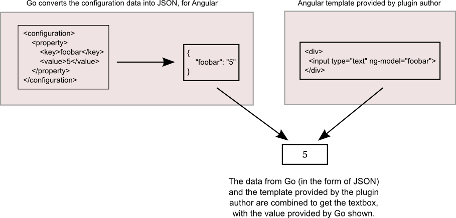

# Angular JS templates in Go plugins

## Overview

Go uses [Angular JS](http://docs.angularjs.org/guide/templates) as its templating engine for plugin UI. This means that plugin authors can use Angular templates to specify how the UI of their plugins looks. Caveat: Some plugin endpoints, like the Package Repository plugin, do not use this for their view.

Because of how Angular is used inside Go, the full power of Angular is not yet exposed to the plugin author. Here are a couple of other relevant links from the Angular JS site, related to templates:

-   [Templates](http://docs.angularjs.org/tutorial/step_08)
-   [Expressions](http://docs.angularjs.org/guide/expression)

## Creating a template for a Go plugin - Configuration UI

### Importance of the configuration key

When an Angular template is used in a Go plugin, to define the configuration UI, the configuration key which is stored in the configuration XML is used everywhere and is expected to be consistent. Since Angular works off of JSON, Go will make sure that the key in the JSON provided to the Angular template is the same as the key in the configuration XML.

Suppose the key of the configuration property stored in the XML is "foobar", with value, "5", then Go will make sure that the value is available to the template as "foobar" when used in an Angular-specific HTML attribute like "ng-model".



So, the name "foobar" needs to be the same across the configuration XML, the Angular template as well as in any code that the plugin has.

### Using Angular expressions in the template

To use an Angular expression (of the form "{{ expression }}") inside a template, you need to use this form:

``` {.code}
{{ GOINPUTNAME[foobar] }}
```

This is needed because Go can potentially use the same form multiple times in a single page (for instance, in a task creation UI, the plugin task can be used as a normal task, as well as an on-cancel task). This causes Angular to confuse the two forms. When an Angular app in written by hand, an author can change the name of the form input element, so that the two forms and their inputs can be considered different. Since Go takes care of this for you, in this case, you need to surround the key with "GOINPUTNAME[" and "]". Go will look for "GOINPUTNAME" and replace it with the form-specific ID, so that both forms work properly and independently of each other.

So, to create a template where anything you enter in a textbox is shown in the dialog box, you can use something like this:

``` {.code}
<div>
  {{ GOINPUTNAME[foobar] }}
  <input type="text" ng-model="foobar">
</div>
```

### Showing validation errors in the UI

Similar to the errors available in Angular (described [here](http://docs.angularjs.org/api/ng/directive/input) and [here](http://docs.angularjs.org/guide/forms)), the server-side validation errors populated by the plugin are available as:

``` {.code}
{{ GOINPUTNAME[foobar].$error.server }}
```

Usually, it is used like this:

``` {.code}
<input type='text' ng-model='foobar'>
<span class="form_error" ng-show="GOINPUTNAME[foobar].$error.server">{{ GOINPUTNAME[foobar].$error.server }}</span>
```

When a plugin, during validation, adds an error to the ValidationResult object, that error message becomes available here and is shown in the span.