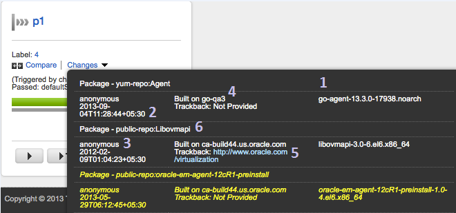

# SCM Material

## Introduction

A build typically consumes source code maintained in a version control system (VCS/SCM). Go has built-in support for Git, Mercurial, SVN, TFS & Perforce. Users can use SCM plugins to poll other SCMs.

### SCMs and Materials

You can define a SCM globally. A pipeline may refer to a SCM as a material. When there is a new revision in the SCM, interested pipelines will get scheduled.

#### SCM Definition

A SCM material plugin lets pipeline group admins provide details of the corresponding SCM type to Go.

##### Note:

1.  The SCM name is not used by the SCM material plugin - it is used by Go to construct the material name.
2.  Two SCMs cannot have the same name.
3.  Use the check connection button to ensure that Go can work with this SCM.

--

Unlike built-in VCS/SCM materials, *the material definition in case of plugin SCMs is not contained within the pipeline definition*. Many pipelines may have material definitions refering to the same SCM. Here is how we associate an existing SCM as material for a pipeline.

--

##### Note:
Each SCM material plugin defines a subset of its properties as a *SCM fingerprint*. e.g. SCM URL and Branch could be included while username and password could be excluded. SCM names are **not** part of SCM fingerprint. It is not permitted to multiple SCMs having the same SCM fingerprint. An attempt to do so will result in an error message like this:

The following error(s) need to be resolved in order to perform this action:<br>
Cannot save SCM, found duplicate SCMs. [SCM Name: 'apple'], [SCM Name: 'orange']

#### Sample XML Configuration

Here is a XML view of an SCM. Note the relation between SCM and pipeline material. Loosely typed property, key and value tags are used for SCM configuration in order to accommodate different plugins. If you choose to configure via direct XML edit, note that it isn't necessary to provide SCM IDs, Go server wil auto-generate them. However, not all validations that are performed while configuring via UI kick in while configuring via XML edit - the resulting failures will show up later in the server health message panel at the bottom right of the browser frame.

```xml
  <scms>
    <scm id="3bfc282e-43a6-4795-ba9c-6c50665220dd" name="git-repo">
      <pluginConfiguration id="git" version="1.0" />
      <configuration>
        <property>
          <key>url</key>
          <value>http://localhost:8080/git-repo</value>
        </property>
      </configuration>
    </scm>
  </scms>
  ...
   <pipelines group="pipeline-group">
    <pipeline name="pipeline">
      <materials>
        <scm ref="3bfc282e-43a6-4795-ba9c-6c50665220dd" dest="dest_dir">
          <filter>
            <ignore pattern="*.log" />
          </filter>
        </scm>
      </materials>
    ...
```

### Permissions

SCMs are global entities not tied to a pipeline group or environment. Pipeline group admins may define SCMs for use in their pipelines. One pipeline group admin may also use SCMs defined by another for their pipelines. Changing a SCM definition will cause all dependent pipelines to schedule - even those not in the same pipeline group as that of the person editing. Hence, we don't have a UI way of changing the definition of a SCM. Only the Go admin can change it via Admin \> Config XML tab.

### Polling

Even if no pipelines use a SCM, Go polls for newer revisions every minute. This may be turned off at a SCM level by setting [`autoUpdate`](../configuration/configuration_reference.md#scm) to false via the config xml (Go admins only). `autoUpdate` is turned on by default. When a newer revision is found for a SCM, the pipelines for which it is a material get scheduled (assuming [auto scheduling of pipelines](../configuration/pipeline_scheduling.md) is on). Also see [API scheduling](../api/pipeline_api.md#key).

*Filters:* At times you may not want Go to trigger pipelines for every commit. e.g. you might not want to 'build' if its a 'documentation' change. You can setup a [filter](../configuration/configuration_reference.md#filter) at pipeline level asking Go to skip pipeline scheduling if commit contains only files that match a pattern.

### SCM information display

The following information is expected from the SCM material plugin (which in turn obtains it from the SCM metadata if available)

1.  SCM revision
2.  Commit time
3.  Name of committer (if available)
4.  Comment for the commit
5.  SCM name

At the time of building the SCM, it is recommended to include as much of the above information as possible so that it is available for Go to display as below.



### SCM checkout on Agent

VCS/SCM plugin will by default checkout code into `destination` directory on Agent before the job begins.
