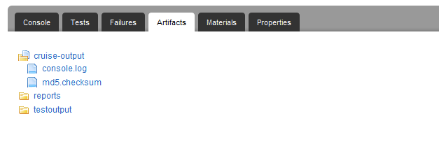

Help documentation
==================

 

Artifact integrity verification<!-- {.collapsible-heading onclick="toggleCollapse($(this));"} -->
===============================

### Overview<!-- {.collapsible-heading onclick="toggleCollapse($(this));"} -->

Go verifies artifact integrity to ensure that they are unchanged from
the point of origin. While executing a job, Go applies the following
rules if the checksum of the downloaded artifact does not match the
checksum at the time of generation of the artifact.

-   If the artifact was uploaded using the artifact API, a warning is
    displayed in the console output for the job
-   If the downloaded artifact is different from the point of
    generation, the job will be failed with an error in the console
    output for the job.
-   If Go is unable to fetch the original checksum for the downloaded
    artifact, a warning is displayed in the console output for the job.

Users who download artifacts for a job from the artifacts tab on the
dashboard can verify their integirty by using the md5.checksum file
within the cruise-output folder available on same tab. The file contains
the name and checksum for each artifact saved by the job.

### Also see...<!-- {.collapsible-heading onclick="toggleCollapse($(this));"} -->

-   [Managing artifacts and
    reports](../configuration/managing_artifacts_and_reports.html)
-   [Auto purge old artifacts](../configuration/delete_artifacts.html)

© ThoughtWorks Studios, 2010

