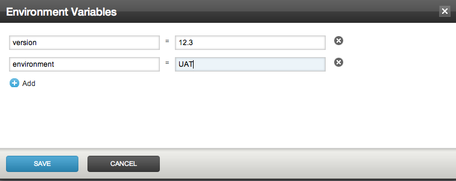
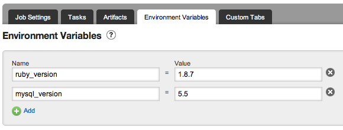

 

Using Environment Variables in Go
=================================

### Standard Go environment variables

Environment Variable

Description

Example contents

GO\_SERVER\_URL

Base URL for the Go server (including the context root)

``` {.code}
https://127.0.0.1:8154/go
```

GO\_ENVIRONMENT\_NAME

The name of the current environment. This is only set if the environment
is specified. Otherwise the variable is not set.

``` {.code}
Development
```

GO\_PIPELINE\_NAME

Name of the current pipeline being run

``` {.code}
main
```

GO\_PIPELINE\_COUNTER

How many times the current pipeline has been run.

``` {.code}
2345
```

GO\_PIPELINE\_LABEL

Label for the current pipeline. By default, this is set to the pipeline
count (this can be set to a [custom pipeline
label](../configuration/build_labelling.html))

``` {.code}
1.1.2345
```

GO\_STAGE\_NAME

Name of the current stage being run

``` {.code}
dev
```

GO\_STAGE\_COUNTER

How many times the current stage has been run

``` {.code}
1
```

GO\_JOB\_NAME

Name of the current job being run

``` {.code}
linux-firefox
```

GO\_TRIGGER\_USER

Username of the user that triggered the build. This will have one of
three possible values

-   anonymous - if there is no security
-   username of the user, who triggered the build
-   changes, if SCM changes auto-triggered the build
-   timer, if the pipeline is triggered at a scheduled time

``` {.code}
changes
```

GO\_DEPENDENCY\_LABEL\_\${pipeline name}

The label of the upstream pipeline (when using [dependent
pipelines](../configuration/managing_dependencies.html))

``` {.code}
1.0.3456
```

GO\_DEPENDENCY\_LOCATOR\_\${pipeline name}

The locator of the upstream pipeline (when using [dependent
pipelines](../configuration/managing_dependencies.html)), which can be used to create the
URL for RESTful API calls

``` {.code}
upstream/1.0.3456/dev/1
```

GO\_REVISION

The current source control revision being run (when using only one
material)

``` {.code}
123
```

GO\_REVISION\_ \${material name or dest}

If you are using more than one material in your pipeline, the revision
for each material is available. The environment variable is named with
the material's "materialName" attribute. If "materialName" is not
defined, then "dest" directory is used. Non alphanumeric characters are
replaced with underscores ("\_").

``` {.code}
123
```

GO\_TO\_REVISION

If the pipeline was triggered with a series of source control
revisions(say 121 to 123), then this environment variable has the value
of the latest revision (when using only one material). This is always
same as GO\_REVISION.

``` {.code}
123
```

GO\_TO\_REVISION\_ \${material name or dest}

If you are using more than one material in your pipeline, the 'to'
revision for each material is available. The environment variable is
named with the material's "materialName" attribute. If "materialName" is
not defined, then "dest" directory is used. Non alphanumeric characters
are replaced with underscores ("\_").

``` {.code}
123
```

GO\_FROM\_REVISION

If the pipeline was triggered with a series of source control
revisions(say 121 to 123), then this environment variable has the value
of the oldest revision (when using only one material)

``` {.code}
121
```

GO\_FROM\_REVISION\_ \${material name or dest}

If you are using more than one material in your pipeline, the 'from'
revision for each material is available. The environment variable is
named with the material's "materialName" attribute. If "materialName" is
not defined, then "dest" directory is used. Non alphanumeric characters
are replaced with underscores ("\_").

``` {.code}
121
```

### Use current revision in a build

It is often useful to use the current version control revision number in
your build. For example, you might want to use the svn version number in
the name of your binary for tracing purposes. Go makes much of this
information available to your build scripts as environment variables.

#### Example usages

#### One material

For this example, we are going to assume we are using a single
[Subversion](http://subversion.tigris.org/) repository for our source
control system and we have a job set up to call the ant target "dist".

-   Add the following target to your ant build.xml
-   Now, when Go runs the 'my-app' pipeline on revision 123, the file
    deploy-123.txt will be created, with the following content:

#### Multiple materials

For this example we are going to assume we are using a
[Subversion](http://subversion.tigris.org/) repository containing the
code and a [Mercurial](http://www.selenic.com/mercurial/wiki/)
repository containing configuration scripts.

-   Ensure the pipeline materials look like this
-   Add the following target to your ant build.xml
-   Now, when Go runs the 'my-app' pipeline with the code at revision
    '123' and the configuration at revision
    '59cab75ccf231b9e338c96cff0f4adad5cb7d335', the file deploy-123.txt
    will be created with the following content:

### Pass environment variables to a job

You can specify variables for Environments, Pipelines, Stages and Jobs.
If a variable is specified more than once, the most specific scope is
used. For example if you specify variable FOO='foo' for an environment,
and FOO='bar' for a Job, then the variable will have the value 'bar'
when the job runs.

#### Setting variables on an environment

You can add variables to an environment by editing the configuration of
the environment. Click on the name of the environment to edit
configuration.



You specify variables on an environment in the Config XML by adding an
[\<environmentvariables\>](configuration_reference.html#environmentvariables)
section to the environment definition.

``` {.code}
<environment name="UAT">
    <environmentvariables>
        <variable name="FOO">
            <value>bar</value>
        </variable>
        <variable name="MULTIPLE_LINES">
            <value>Variable values can have
            multiple lines (assuming that your operating system supports this correctly).
            </value>
        </variable>
        <variable name="COMPLEX">
            <value><![CDATA[<complex
            values>]]>
            </value>
        </variable>
    </environmentvariables>
    <agents />
    <pipelines />
</environment>
```

You can add variables for a job by editing the job configuration.



You specify variables on an job in the Config XML by adding an
[\<environmentvariables\>](configuration_reference.html#environmentvariables)
section to the job definition.

``` {.code}
<job name="my-job">
    <environmentvariables>
       <variable name="FOO">
            <value>bar</value>
        </variable>
        <variable name="MULTIPLE_LINES">
            <value>Variable values can have
            multiple lines (assuming that your operating system supports this correctly).
            </value>
        </variable>
        <variable name="COMPLEX">
            <value><![CDATA[<complex
            values>]]>
            </value>
        </variable>
    </environmentvariables>
    ...
</job>
```

### Using environment variables in task

You can access these environment variables to construct versioned
artifacts or to store properties on the current build. For example the
following snippet of an ant file shows how to access Go variables:

``` {.code}
<property environment="go" />
<target name="all">
    <echo message="Building all!" />
    <echo message="GO_SERVER_URL: ${go.GO_SERVER_URL}" />
    <echo message="GO_PIPELINE_NAME: ${go.GO_PIPELINE_NAME}" />
    <echo message="GO_PIPELINE_COUNTER: ${go.GO_PIPELINE_COUNTER}" />
    <echo message="GO_PIPELINE_LABEL: ${go.GO_PIPELINE_LABEL}" />
    <echo message="GO_STAGE_NAME: ${go.GO_STAGE_NAME}" />
    <echo message="GO_STAGE_COUNTER: ${go.GO_STAGE_COUNTER}" />
    <echo message="GO_JOB_NAME: ${go.GO_JOB_NAME}" />
    <echo message="GO_REVISION: ${go.GO_REVISION}" />
</target>
```

CRUISE\_XXX variables are deprecated since Go 2.0. Please use GO\_XXX
instead of CRUISE\_XXX (For example: GO\_SERVER\_URL instead of
CRUISE\_SERVER\_URL).


© ThoughtWorks Studios, 2010

