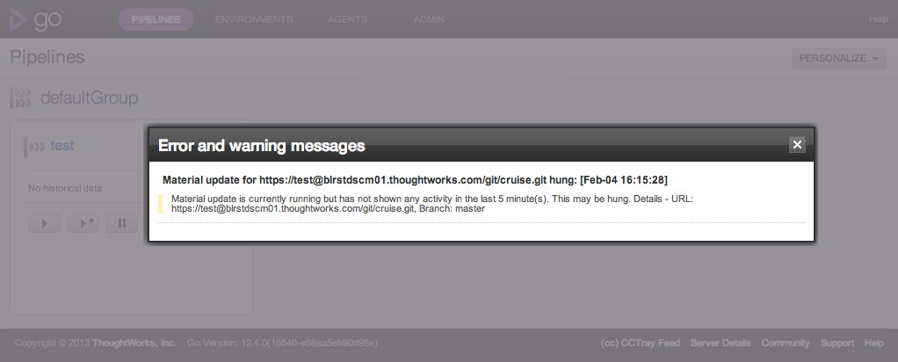

Help documentation
==================

 

Go unable to poll for changes {.collapsible-heading onclick="toggleCollapse($(this));"}
=============================

Go server polls for changes to all materials of 'Auto Triggered'
pipelines. By default, polling occurs every minute and ten materials at
a time. The polling interval and the number of materials to be polled
simultaneously are configurable.

Go uses SCM commands to poll for changes. For example, to check for any
new changes in SVN repository the following command is used:

``` {.code}
svn log --non-interactive --xml -v -r HEAD:'revision' 'repository-URL'
```

The SCM command used by Go server can hang with no output. Invalid
configuration, network issues, console input block are some of the
causes for such a situation. Such scenarios cause pipeline scheduling
delays and also lead to performance degradation

Such a scenario is notified to the users by a warning in Server Health;
when clicked shows a message similar to the one below.



### What can I do with the information {.collapsible-heading onclick="toggleCollapse($(this));"}

When you see warning messages like the one above

-   Identify the processes running as children of Go Server
-   Determine the process that's hung. The extra information like URL:
    "https://test@bitbucket.org/test/git\_repo.git" in the warning
    information should help you with this.
-   On linux system, you should see lines like these:
-   Kill the process and all its children (the whole process tree).
-   Ensure that the warning message goes away from Server Health.

### Configuring warning time {.collapsible-heading onclick="toggleCollapse($(this));"}

-   Go server waits for 15 minutes (of no output) before it warns user
    about possible hung material update. User can modify this wait time
    using a System Property: 'material.update.inactive.timeout'.
-   On linux installations of Go server, add the following line to
    /etc/default/go-server.

    ``` {.code}
    export GO_SERVER_SYSTEM_PROPERTIES='-Dmaterial.update.inactive.timeout=20'
    ```

    The above configuration sets the time that Go server uses to
    determine if a material update is possibly hung, to 20 minutes.

-   On Windows, add the following line in the
    *[wrapper-properties.conf](../installation/installing_go_server.html)* file in the
    config folder of the Go server installation where **x** is 1 more
    than the highest number in *wrapper-server.conf* and
    *wrapper-properties.conf* combined.

    ``` {.code}
    wrapper.java.additional.x='-Dmaterial.update.inactive.timeout=20'
    ```

    The above configuration sets the time that Go server uses to
    determine if a material update is possibly hung, to 20 minutes.

Your search did not match any help pages.


© ThoughtWorks Studios, 2010

