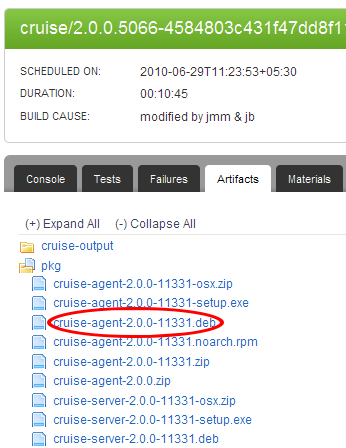

Help documentation
==================

 

Releasing into an environment {.collapsible-heading onclick="toggleCollapse($(this));"}
=============================

One of the most useful aspects of having your build mapped as a
pipeline, is being able to know exactly what is in a particular
environment. For example, you might have a User Acceptance Testing
environment into which you want Go to automatically deploy your binary.
Due to process restriction within your company, you might want to
manually install a binary yourself, but have Go still retain the
information of what is currently released.

### Example usages {.collapsible-heading onclick="toggleCollapse($(this));"}

#### Automatically deploy to UAT {#deploy_uat .collapsible-heading onclick="toggleCollapse($(this));"}

For this example, we'll assume that there is already an ant task defined
in your build that will take a binary and deploy it to your environment.
A seperate task will verify the install was successful. If it is not, a
task will run to rollback the deployment. We will also assume that
earlier in the pipeline there is a **dist** stage with a
**create-installers** job that will have already created the binary for
us to use.

-   [Add a new stage](admin_add_stage.html) named **UAT** with a job
    named **deploy**
-   [Ensure that the **UAT** stage is
    manual](dev_choose_when_stage_runs.html)
-   Ensure the following task block is in the **deploy** job
    configuration

When you are ready to deploy something into the UAT environment...

-   Navigate to the [pipeline activity](../navigations/pipeline_activity_page.html)
    page
-   Find the check-in you want to deploy
-   Click on the manual transition into the **UAT** stage
-   
-   When the deploy is successful, the stage will be green and the UAT
    environment will contain the selected check-in
-   
-   When the deploy fails for some reason, the stage will be red and the
    UAT environment will contain the original check-in

#### Manually deploy to production {#deploy_prod .collapsible-heading onclick="toggleCollapse($(this));"}

For this example, we'll assume that there is a known way to rollback to
a previous installation. We will also assume that earlier in the
pipeline there is a **dist** stage with a **create-installers** job that
will have already created the binary for us to use.

-   [Add a new stage](admin_add_stage.html) named **production** with a
    job named **deploy**
-   [Ensure that the **production** stage is
    manual](dev_choose_when_stage_runs.html)
-   Ensure there is no task block in the **deploy** job configuration

When you are ready to deploy something into the production
environment...

-   Navigate to the [pipeline activity](../navigations/pipeline_activity_page.html)
    page
-   Find the check-in you want to deploy
-   Click on the details link of the **dist** stage
-   
-   Download the installer binary in the artifacts tab
-   
-   Manually install the binary into production
-   If there are issues, manually rollback to the last known good
    installation
-   If everything seems to be working correctly, click on the manual
    transition into the **production** stage

© ThoughtWorks Studios, 2010

