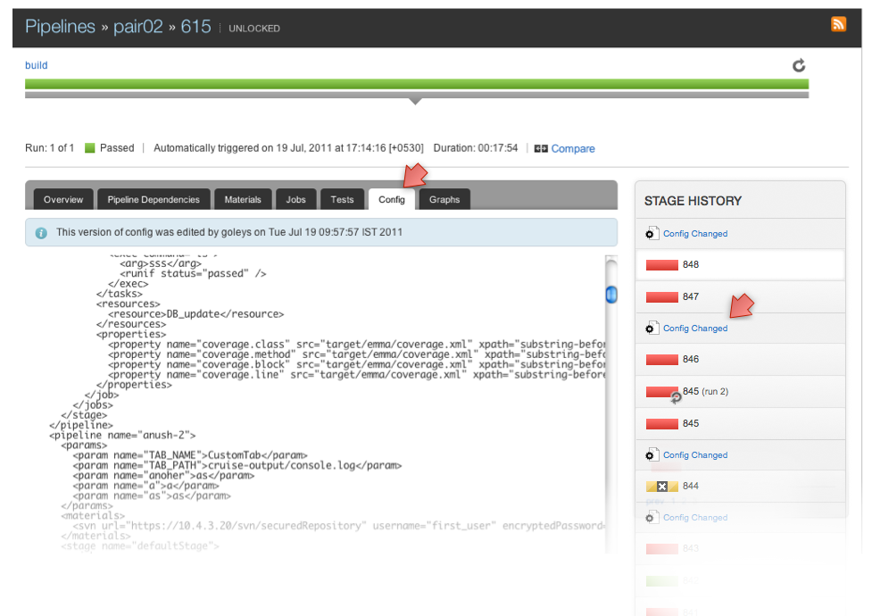
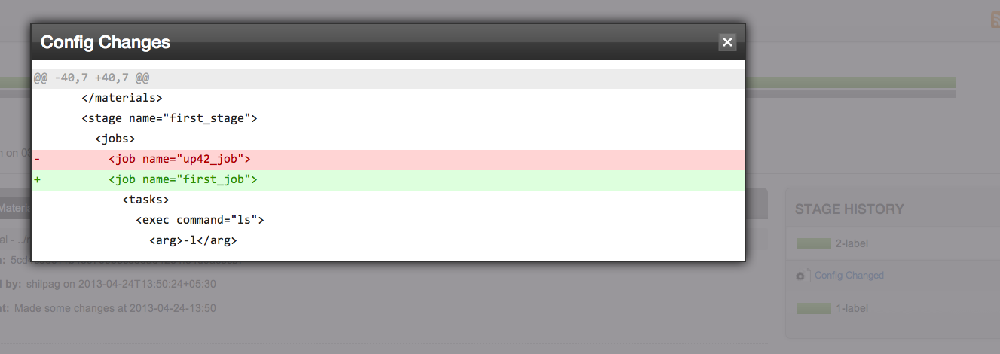

Help documentation
==================

 

Historical Configuration {.collapsible-heading onclick="toggleCollapse($(this));"}
========================

### Trace a stage run to it's config {.collapsible-heading onclick="toggleCollapse($(this));"}

Go provides a section on the stage details page to view the Go
configuration xml used when executing a particular instance of the
stage. Admin users can use this view to trace a pipeline run back to
it's configuration. The stage history widget which can be found on the
right hand side of the stage details page has markers to indicate Go
configuration changes. These markers are visible to all users.

**To navigate to the historical config:**

1.  Click on the stage bar of the relevant stage on the pipelines
    dashboard.
2.  Click on the tab 'Config'.
3.  Choose the stage instance from the stage history widget on the
    right.

Note: This tab is available to admin users only.

### See what changed in the configuration between two stage runs {.collapsible-heading onclick="toggleCollapse($(this));"}

As mentioned in the previous section, the stage history widget has
markers to show if configuration has changed between two stage runs. For
admin users, who have the permission to view the configuration xml, the
markers appear as links. Clicking on these links shows the exact
difference between the configurations. The changes are shown in the same
format as that of "Git Diff".

Your search did not match any help pages.

© ThoughtWorks Studios, 2010

