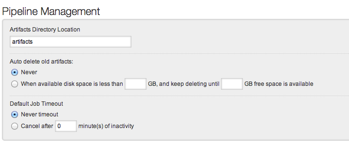
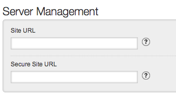

# Configuring server details

## Entering your license key

Go requires you to enter a license key before you can use it with remote agents

You should have been emailed a license key when you downloaded Go. If not, you can get a trial license key from the Studios website: visit the [Go homepage](http://www.thoughtworks.com/products/go-continuous-delivery) and follow the instructions to get your trial license.

Click on "Server Configuration" tab of the "Admin" tab.

You will see the License section


Your license key is tied to the username you used to register. Enter the username you used to register, and copy and paste the license key from your email into the textbox provided. Go will ignore spaces, line breaks and so forth in the license key.

When you are done, click on "Save" in the bottom of the "Server configuration" page. Go should tell you either that your license key has been updated successfully, or give you an error message telling you what went wrong.

You can also specify the license by clicking on "Server Details" link in the bottom of Go footer after logging in


Once you've entered your license key, you can proceed to [set up your first pipeline](../configuration/quick_pipeline_setup.html) by clicking on the "Pipelines" tab.

## Artifact repository configuration

Go needs no configuration once installed. However, we recommend that you create a separate partition on your computer's hard disk for Go server artifacts. The artifact repository can grow in size very quickly. If located on your system's main partition you may experience data loss and unpredictable application behaviour as the disk fills up.

Once you have created a new disk partition, you need to tell Go where to find it.

Click on "Server Configuration" tab of the "Admin" tab. Go to the "Pipeline Management" section.



Specify the artifacts directory location and click on "Save"

Power users can also configure this via the **Config XML** tab on the
Admin section:

``` {.code}
  <cruise>
    <server artifactsdir="/path/to/artifacts/directory">
    ...
    </server>
  </cruise>
```

In Windows, you may need to assign your artifact repository partition a separate drive letter. In Windows, your configuration might look like this:

``` {.code}
  <cruise>
    <server artifactsdir="E:\go-artifacts">
    ...
    </server>
  </cruise>
```

When you have entered this information, click "Save" to save the configuration file.

You can change the artifacts directory location at any time using the method described above, even when Go is running. However Go will not move existing artifacts to the new location for you, and changing the location while Go is running won't take effect until Go Server is restarted.

If you decide to move your artifact repository, the safe way to do it is:

1.  pause all pipelines and wait until all active jobs on the agent grid has completed (all agents are in the state "idle")
2.  shut down Go server
3.  copy the artifact repository to the new location
4.  edit Go's configuration file manually as described above to tell Go where to find the artifacts
5.  restart Go server

Even when all active jobs on the agent grid have stopped, users may still be uploading artifacts using the RESTful URLs. This is why we need to stop Go server completely in order to be safe.

## Configure site URLs

Click on "Server Configuration" tab of the "Admin" tab. Go to the "Server Management" section.



Go generates URLs that are relative to the base URL of the request. However, there are scenarios, such as sending emails, generating feeds where Go cannot rely upon publishing URLs relative to a request. If you have fronted Go with a reverse proxy, this value should be the base URL for the proxy and not the internal Go address. For this reason, it is necessary to specify this configuration. This URL should contain the port if your base URL contains a non-standard port.

Power users, if they so desire, can directly update the [server](../configuration/configuration_reference.html#server) section.

``` {.code}
    <cruise>
          <server siteUrl="http://<host>:<port>" secureSiteUrl="https://<host>:<securePort>">
            ...
          </server>
    </cruise>
```

Certain features in Go, such as Mingle integration, require an HTTPS(SSL) endpoint. If you wish that your primary site URL be HTTP, but still want to have HTTPS endpoints for the features that require SSL, you can specify the secureSiteUrl attribute with a value of the base HTTPS URL.

## Also see...

-   [Installing Go agents](../installation/installing_go_agent.html)
-   [Configure Go to work with a proxy](../installation/configure_proxy.html)
-   [Displaying mingle gadgets in Go](../integration/mingle_in_go.html)