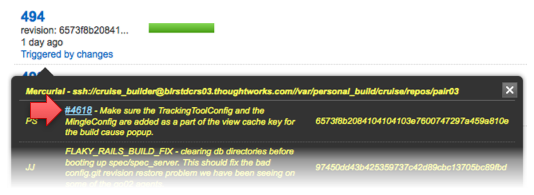

Help documentation
==================

 

Integration with external tools {.collapsible-heading onclick="toggleCollapse($(this));"}
===============================

### Integration with bug tracking and story management tools {#tracking_tool .collapsible-heading onclick="toggleCollapse($(this));"}

Go allows you to link your commit messages with bug tracking and story
management tools which are web applications.

The following shows an example of tracking cards on Mingle by card
numbers starting with a "\#" (e.g: \#4618):


The pattern has an extra "\#" because it is an escape character for a
parameter. [More
information...](admin_use_parameters_in_configuration.html)

For power users, here's how you'd do it from Config XML:

``` {.code}
<pipeline name="mypipeline">  
  <trackingtool link="http://mingle.thoughtworks.com/go/${ID}" regex="##(\d+)"/>  
  ...
</pipeline>
```

Now, when a user commits code with comments like "\#4618 - Make sure the
TrackingToolConfig and...", Go detects the modifications and
automatically links story/bug numbers to the configured tracking tool:



### Monitoring your builds with client tools {#cctray .collapsible-heading onclick="toggleCollapse($(this));"}

Go allows you to monitor your builds with CCTray through the url
'http://[your_go_server]:8153/go/cctray.xml.

If you have switched on security in your configuration you can use BASIC
authentication to connect. In many cases you can do this by including
the username and password in the URL. The username and password should
not include special characters.

For example:

``` {.code}
http://[username]:[password]@[your_go_server]:8153/go/cctray.xml
```

From 12.3, the CCTray feed includes a message tag with the "breakers"
attribute that includes names of users who made the commit that broke
the pipeline. Most CCTray clients support this message tag.


© ThoughtWorks Studios, 2010

