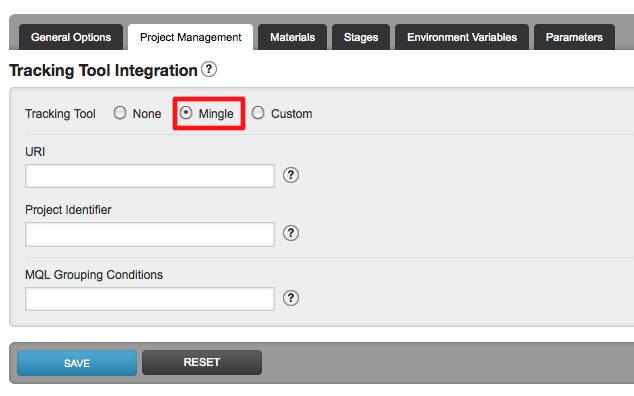
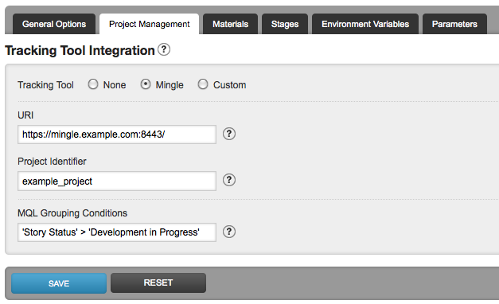
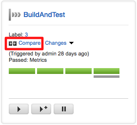

 

Mingle Card Activity Gadget {.collapsible-heading onclick="toggleCollapse($(this));"}
===========================

Go's Mingle card activity gadget allows users to see the new activity in
a pipeline in terms of the Mingle cards that were worked on in that
period. This card activity can reflect information about your project,
such as which features were just deployed to production or which
features require testing.

For this feature to work, the Go and Mingle administrators must first
[configure the display of Mingle gadgets in Go](mingle_in_go.html).

### Configuring Mingle Card Activity for a Go pipeline {.collapsible-heading onclick="toggleCollapse($(this));"}

Navigate to the Administration page for the pipeline for which you would
like to view card activity.

Open the 'Project Management' section for the pipeline and select
'Mingle' for the 'Tracking Tool Integration'.

There are three fields used by the card activity feature:

-   **URI** - Required field. The base URI for the Mingle instance that
    hosts your Mingle project.
-   **Project Identifier** - Required field. The identifier for your
    Mingle project. This identifier can be found in the 'Basic
    Information' section under the 'Project admin' tab for your Mingle
    project.
-   **MQL Grouping Conditions** - Optional field. MQL snippet used to
    provide additional information regarding the cards that appear in
    your card activity table. This MQL is used to determine whether the
    cards are in a particular state, such as "Greater than In
    Development." If this is supplied, the cards will be grouped into
    cards that currently meet the MQL condition, cards that once met the
    conditions but no longer do, and those that have never met the
    conditions.

Below is an example configuration for the card activity feature:

### Accessing Mingle Card Activity in Go {.collapsible-heading onclick="toggleCollapse($(this));"}

There are several locations from where Mingle card activity can be
accessed. These include:

-   Pipelines Dashboard page
-   Pipeline instance details page
-   Environments page
-   Stage History section on the Materials page for a pipeline

On each of these pages, a 'Compare' link will be displayed for each
pipeline or pipeline instance. For example, the screenshot below depicts
the 'Compare' link as displayed on the Pipelines Dashboard page.

### Card Activity information {.collapsible-heading onclick="toggleCollapse($(this));"}

For cards to be included in the card activity list, the commit messages
must include the card number in the following format: \#card\_number
(e.g. \#412). Do not put a space between the \# and the card number.

#### With MQL Grouping Conditions {.collapsible-heading onclick="toggleCollapse($(this));"}

When MQL Grouping Conditions are used, the cards are listed in groups
according to whether they:

  -------------------------------------------------------------------------
  Icon
  Meaning
  ------------------------------------ ------------------------------------
                _conditions.png)
  Currently meets the conditions       Did meet the conditions, but no
                                       longer does
  -------------------------------------------------------------------------

Below is an example of what the card activity will look like when MQL
grouping conditions are supplied. Cards currently meeting the conditions
will be shown at the top of the list.

#### Without MQL Grouping Conditions {.collapsible-heading onclick="toggleCollapse($(this));"}

When MQL Grouping Conditions are not provided, the cards are listed in
the order in which the commits were made against them.

Card activity reflects the "live" state of Mingle, at the time you are
viewing this page. That is, the card activity shown is not a snapshot of
Mingle data from the time of pipeline execution of deployment. As
changes are made to cards in Mingle, this page will reflect the latest
card activity.

### Also see {.collapsible-heading onclick="toggleCollapse($(this));"}

-   [Integrating Go with Mingle - an overview](mingle_integration.html)
-   [Reference for Mingle card activity
    gadget](mingle_card_activity_gadget.html)
-   [What is OAuth?](../faq/what_is_oauth.html)
-   [What is OpenSocial?](../faq/what_is_opensocial.html)

© ThoughtWorks Studios, 2010

