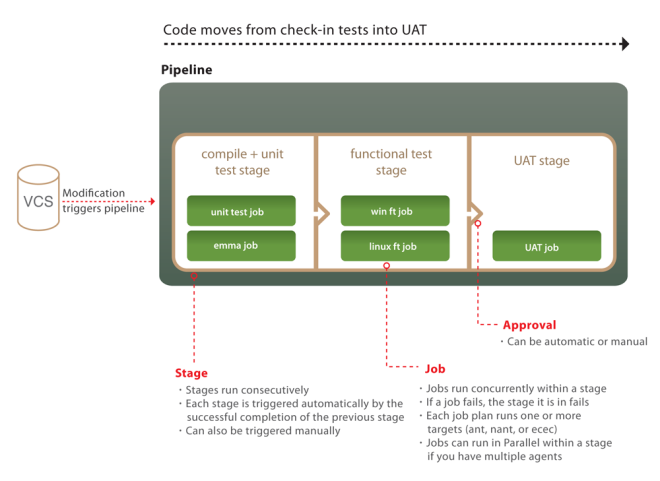
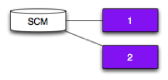
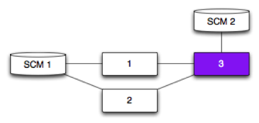
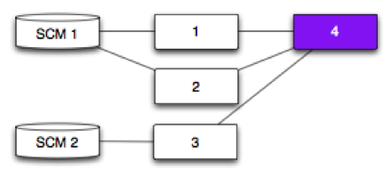
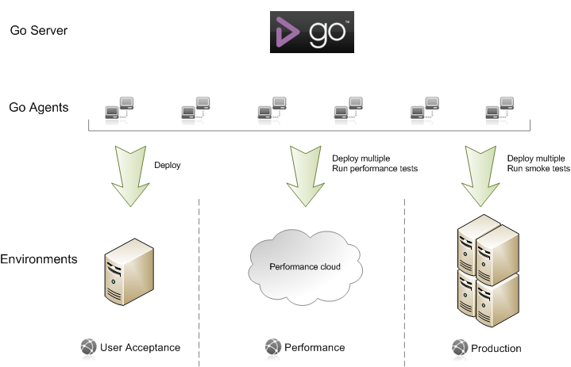

#Introduction

Go is an advanced Continuous Integration and Release Management system. It takes an innovative approach to managing the build, test and release process. In order to find your way around Go, you need to understand how Go sees the world. This page explains some basic concepts in Go.

If you want to know more about Continuous Integration and delivery, in general, refer to Martin Fowler's article on the subject: [Continuous Integration](http://martinfowler.com/articles/continuousIntegration.html) and [Continuous Delivery](http://martinfowler.com/bliki/ContinuousDelivery.html).

## Build Agents

As with all modern continuous integration systems, Go lets you distribute your builds across many computers - think *build grid* or *build cloud*.

And why use a build cloud? There are three main reasons:

-   Run your tests on several different platforms to make sure your software works on all of them
-   Split your tests into several parallel suites and run them at the same time to get results faster
-   Manage all your environments centrally so you can promote builds from one environment to the next

It is extremely simple to get agents up and running in Go. First, install the Go agent software on each computer that is to be a part of your cloud. Next, configure each build agent to connect to your Go server. Finally, approve every build agent in your cloud from the management dashboard in the Go administration page. You are now ready to build. Additionally, you should associate relevant *resource* tags with each of your agents to better specify the kinds of build tasks with which each agent is compatible.

### Agent lifecycle

Go supports a grid of Agents that can run Jobs. Agents periodically contact the Go server to ask if there is any work. The server checks to see what resources the Agent has, and assigns any available Jobs that match those resources.

When an Agent runs a Job, it creates a sandbox directory under the agent's directory. All materials are updated into this directory. This directory may be different on different agents depending on how the agent was configured and which operating system the agent is running on.

For example consider a pipeline named `my-pipeline`. On a default linux install, the working directotry for this pipeline would be `/var/lib/go-agent/pipelines/my-pipeline`. On a default Windows installation, it would be `C:\Program files\Go Agent\pipelines\my-pipeline`.

All materials are updated in this directory. If a material has a `dest` folder specified, then the material is updated into a folder of that name, under the base sandbox directory.

For example suppose the pipeline has an SVN material with a destination folder name of `tools` then the svn files will be checked out into `tools` directory. For pipelines with multiple materials, you are required to provide distinct checkout directory for each of the materials.

Once the materials have all been updated, the Agent runs each of the tasks in turn. You can specify a working directory (`workingdir`) on a task. When the task runs it will be run relative to the pipeline sandbox.

For example if there is a task that runs `/usr/bin/make` with a workingdir of `tools/my-tool` then this will run in the directory `pipelines/my-pipeline/tools/my-tool`.

When all the tasks have been completed the agent will publish any artifacts defined in the Job. Again the artifact directories are relative to the pipeline sandbox directory.

### Full example

Consider the following configuration:

```xml
<pipeline name="my-product">
  <materials>
    <svn  url="http://my-svn-server/tools" dest="tools"/>
    <svn  url="http://my-svn-server/my-project" dest="my-project"/>
  </materials>
  <stage name="compile">
    <job name="linux">
      <environmentvariables>
        <variable name="FOO">
           <value>bar</value>
        </variable>
      </environmentvariables>
      <resources>
        <resource>linux</resource>
      </resources>
      <tasks>
        <exec command="/usr/bin/make" args="-f Makefile" workingdir="tools/my-tool"/>
        <ant target="unit-test" workingdir="my-project"/>
      </tasks>
      <artifacts>
        <artifact src="my-project/target/deployable.jar" dest="pkg"/>
      </artifacts>
    </job>
  </stage>
</pipeline>
```

The Go Agent will:

-   Create the directory `<agent installation directory>/pipelines/my-product` if it does not exist
-   Checkout or update the svn material `http://my-svn-server/tools` into `agent installation dir>/pipelines/my-product/tools`
-   Checkout or update the svn material `http://my-svn-server/my-project` into `<agent install directory>/pipelines/my-product/my-project`
-   run `/usr/bin/make` in the directory `<agent installation directory>/pipelines/my-product/tools/my-tool`
-   run ant in the directory `<agent installation directory>/pipelines/my-product/tools/my-project`
-   publish `<agent installation directory>/pipelines/my-product/my-project/target/deployable.jar` to the server

## Pipelines

A pipeline allows you to break down a complex build into a sequence of simple stages for fast feedback, exhaustive validation and continuous deployment.

### How Go models distributed work

The unit of work in Go is called a *job* . A job is a set of build tasks that can be performed on a single agent in your cloud. You can associate specific build *resources* with each build agent - a specific operating system or compiler version, for example. Go makes sure build jobs that require specific build resources are directed to build agents with the appropriate resources. By default, build jobs can be picked up by any agent. Resources are simple text tags which you associate with each agent. You can specify as many of them as you want. This flexibility is important as the agent process itself does not automatically determine anything about its environment.

Jobs are grouped into stages. A *stage* is a collection of build jobs that can be executed in parallel. This is the mechanism that allows you to, for example, split test suites into multiple parallel streams or run the same build on multiple platforms simultaneously. A stage passes only when all the jobs in the stage pass.

Stages are then joined sequentially into a *pipeline* . Stages trigger in the order they appear in the pipeline's raw configuration. They can be triggered by: a change in your version control system, manually forcing the pipeline to become active or by a dependency on a given stage of another pipeline. When a stage completes successfully, it triggers the next stage in the pipeline automatically, by default. Alternatively, you can require a manual *approval* to trigger the next stage. This manual approval requires user intervention. You can delegate the permissions for approval of stages to individuals or groups of users.

### An example pipeline

So what does a pipeline look like? Here is an example:



The first stage has two jobs. The unit test job compiles the code and runs the unit tests. The compiled code is then uploaded to the artifact repository. This is the one and only time the code is compiled and of course if you are using an interpreted language you can skip this step. The second job does static analysis of the code, uploading the results as html test reports and build properties for further analysis.

When the first stage passes, it automatically triggers the functional test stage. The jobs in this stage download that binaries from the artifact repository, and run a series of functional tests. One job runs on a Linux box, the other on Windows. If your tests take a long time to run, you could split them into suites and run these as multiple jobs in parallel.

Finally there is a stage which deploys your software into your UAT environment for manual testing. This stage has a manual approval in front of it, meaning that somebody has to click a button in order to deploy the application into UAT. Running this stage proves out your automated deployment process - and it should include some smoke tests that make the job fail if the deployment doesnot work.

The pipeline metaphor gives you several important benefits:

-   Because of the way pipelines are modeled and presented, it is trivially easy to match up an acceptance test failure, or a flaw in the UAT environment, with the version of the code that caused it.
-   Because you only compile once, you ensure that the thing you are testing is the same thing you will release, and you do not waste resources compiling repeatedly.
-   Finally, Go allows you to build manual steps into your testing process so that your QAs and users can manually test your software.

### Pipeline groups

The Go dashboard allows you to visualize pipelines at a glance. You can then group pipelines together into pipeline groups. Beyond the visual convenience of grouping related pipelines, there are access and security features that allow you to control the set of users that can view a particular pipeline group. This can be a powerful way to carve out more secluded build areas for your users. Consult the Security section for more information

## Pipeline dependencies

A dependency is created when a pipeline is configured to depend on either an SCM or another pipeline. The domain concept for this is called a material. If a pipeline has a dependency it has been configured to have either an *SCM material* or a *pipeline material*.

### SCM Dependency


Pipeline 1 depends on an SCM.

Pipeline 1 will trigger each time it polls the SCM and detects a new revision.

### Pipeline Dependency


Pipeline 2 depends on Pipeline 1.

Pipeline 2 will trigger each time Pipeline 1 successfully completes.

### Pipeline and SCM Dependency


Pipeline 2 depends on Pipeline 1 and an SCM.

The expectation may be that a new revision will trigger both Pipeline 1 and 2. That’s not the case.

Instead, Pipeline 2 will only trigger if a new revision has successfully passed through Pipeline 1.

Real world example:

SCM contains application code and acceptance tests

Both pipelines depend on the SCM

Pipeline 1 compiles code and creates an artifact

Pipeline 2 fetches the build artifact and runs the tests that were written for the compiled code

Pipeline 2 has to use the same acceptance tests committed with the code

Someone commits code and tests as part of the same SCM commit.

### Fan-out



Pipeline 1 and 2 depend on the same SCM.

A new revision will trigger both Pipeline 1 and 2.

Why fan-out?

Speed up the feedback loop and enable a team to fail and learn faster.

### Fan-in - Pipeline


Pipelines 1 and 2 depend on an SCM.

Pipeline 3 depends on Pipelines 1 and 2.

The expectation may be that any successful run of Pipeline 1 or Pipeline 2 will trigger Pipeline 3. That’s not the case.

Instead, Pipeline 3 will only trigger if a new revision (SCM) has successfully passed through both Pipeline 1 and Pipeline 2.

Why fan-in?

Faster feedback - You can fan-out to get significantly faster feedback now that Go handles the fan-in.

Eliminates spurious builds - Test software only when it is necessary and do not waste resources.

Meaningful feedback - No false-positives or false-negatives.

### Fan-in - Pipeline and SCM



Pipelines 1 and 2 depend on SCM 1.

Pipeline 3 depends on Pipelines 1 and 2, and SCM 2.

Pipeline 3 will trigger:

if a new revision (SCM 1) has successfully passed through both Pipeline 1 and Pipeline 2

each time it polls SCM 2 and detects a new revision

### Fan-in - Pipeline with different originating SCM



Pipelines 1 and 2 depend on SCM 1.

Pipeline 3 depends on SCM 2.

Pipeline 4 depends on Pipelines 1, 2 and 3.

Pipeline 4 will trigger:

if a new revision (SCM 1) has successfully passed through Pipelines 1
and 2.

each time Pipeline 3 successfully completes (SCM 2)

## Deployment and Environments

Any moderately complex piece of software typically goes through a series of environments prior to release. A typical set of environments may look like this:

-   Development
-   User Acceptance Testing
-   Performance
-   Production

Deployment of software into an environment is often a non-trivial process that involves several steps, potentially required to be repeated on several machines. With Go, you have an easy to manage environment dashboard that simplifies the deployment process down to a single click.

An environment in Go is essentially a collection of agents and pipelines. Agents can be shared across environments, however, pipelines cannot. An environment pipeline is used to perform tasks specific to an environment.

### An example

So how would this work for me? Here is an example:



In this scenario, we have three different environments - User acceptance, Performance, and Production. At any given time, each environment may contain a different build of the deployed software.

Each environment has a pipeline (represented by the downward arrow) that performs a set of tasks specific to each environment.

-   **User Acceptance:** The pipeline performs a *deploy* task on a single machine.
-   **Performance:** The pipeline first performs a *deploy* on a cluster of performance machines and then triggers a suite of *performance tests* .
-   **Production:** The pipeline first performs a *deploy* on a load balanced cluster of machines and then triggers a suite of *smoke tests* to validate the deployment.

Each of these environment pipelines deploys using the same build thereby mitigating any unforeseen issues due to inconsistent versions.

The environments dashboard also give you a bird's eye view of which versions are deployed in which environment giving you a configuration management console as well.
