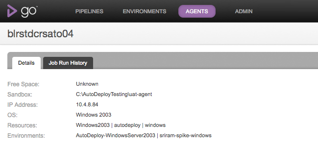
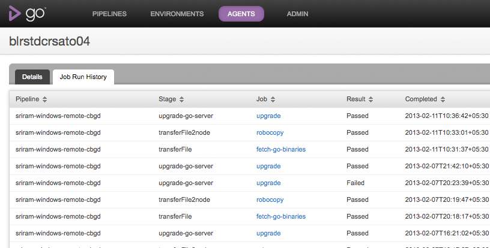

# Details of a single agent

Go now provides a page that shows the details of a single agent. This page provides details about the agent configuration and the history of all the jobs that ran on that agent.

## Agent Details tab

This tab shows the configuration and runtime information of an agent. For example, this tab shows the free space available on the agent, the IP Adress and the OS of the agent.

In terms of configuration, this tab shows the resources of the agent and the environment it belongs to. A sample Details tab looks as below:

## Job Run History tab

You must be logged in as an admin user to configure this step.

This tab shows a table of all the completed jobs that ran on this agent. A sample page is shown below

For every job, the following columns are shown:

1.  Pipeline: The pipeline to which the job belongs to
2.  Stage: The stage to which the job belongs to
3.  Job: The name of the job
4.  Result: The result of the job - Passed, Failed, Cancelled or Rescheduled
5.  Completed: The date when the Job completed
6.  Duration: The duration that the Job took to finish - from scheduled till completed.

The job listing table can be sorted on any column, except for the Duration column.

### Using Agent details to debug agent issues

This page is useful to figure out if there are agent issues and hence a certain job keeps failing on that agent.

Consider a job which runs functional tests for a web application that need a browser to be available. The job was passing so far and only recently it has started to fail intermittently. Here are the steps you can follow to figure out if this is an agent issue.

1.  Navigate to the [Job Details page](../navigations/job_details_page.html) of the given job that failed.
2.  Locate the "Agent" label and click on the link to the agent
3.  Navigate to the "Job Run History" tab
4.  Sort on the Job Name and locate the job that just navigated from

You'd notice that the job started to fail recently. You can even see if there are other jobs that have started failing around the same time by now sorting on the Completed date.